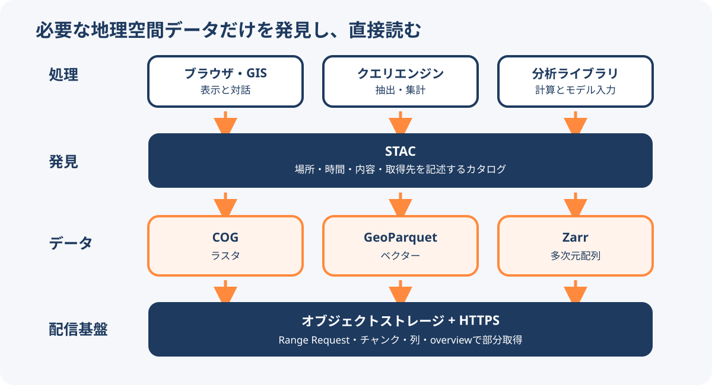

# Cloud Native Geospatial

Cloud Native Geospatial（CNG）は、地理空間データをクラウド上で扱いやすくするための、形式、配信方法、ツール、運用上の実践をまとめた考え方である。単一の規格や製品名ではない。利用者がデータ全体をダウンロードせず、必要な範囲、列、解像度、時間だけをネットワーク越しに読めるようにすることが中心にある。

<figure markdown="span">
  
  <figcaption>CNGを、発見・保存・処理の役割分担として整理した図。厳密な標準階層ではなく、GeoAIアトラスでの整理である。</figcaption>
</figure>

## 3つの役割で捉える

| 役割 | 主な技術 | 何を解決するか |
| --- | --- | --- |
| カタログ | STAC | いつ、どこに、どのようなデータがあるかを記述し、発見できるようにする |
| データ | COG、GeoParquet、Zarrなど | 必要な部分だけを読み出せるよう、ラスタ、ベクター、多次元配列を配置する |
| 処理 | ブラウザ、GIS、クエリエンジン、分析ライブラリ | 専用サーバーを必須にせず、保存先のデータへ直接問い合わせる |

この3層は固定された製品構成ではない。データの種類や用途に応じて形式と処理系を組み合わせるための整理である。STACは実データのファイル形式ではなく、データ資産を記述して探すためのカタログ仕様である。

## 必要な部分だけを読む

CNGでは、オブジェクトストレージとHTTPSを使い、ファイルの一部や特定のチャンクを取得する。代表的な仕組みは次のとおりである。

- COGは内部タイルとoverviewを持ち、HTTP Range Requestで必要な解像度と範囲を読む。
- GeoParquetは列指向のParquetを基盤とし、必要な列やrow groupに絞った分析を行う。
- Zarrは多次元配列をチャンクへ分け、必要な領域や時間の配列だけを読む。
- STACはデータの空間・時間範囲や取得先を記述し、対象資産を絞り込む。

ファイル形式だけを変えても、配信サーバーがRange RequestやCORSに対応していなければ、ブラウザや分析ツールからの部分読み込みは機能しない。データ配置、メタデータ、HTTP配信、利用側ツールを一体で設計する必要がある。

## データの種類と利用者層

2026年9月14日のPSS解説は、データ層をCOGなどの画像、Zarrの多次元配列、COPCの点群、GeoParquetやFlatGeobufのベクターとして整理している。Atlasでは点群を画像ラスタとは区別し、既存図の「データ」へ対応づける。

処理層にはDuckDBやXarrayとDaskの組み合わせなどがある。AIエージェントはカタログや処理ツールを利用する側に位置づけられる。エージェントの追加によって、データ形式と処理エンジンの役割が同一になるわけではない。

## コミュニティと標準化

Cloud-Native Geospatial ForumはRadiant Earthのイニシアチブであり、ベンダー中立なイベント、文書、教育、コミュニティ運営を行う。CNG自体は標準化団体ではなく、STAC、COG、GeoParquet、Zarrの規格やコードを直接管理する組織でもない。実務コミュニティで有効性が確かめられた実践の一部が、OGCなどの標準化へつながる関係にある。

## ベクター形式の使い分け

2026年9月18日のPSSの記事は、GeoParquetとFlatGeobufを処理目的で比較している。

| 形式 | 記事が示す特徴と用途 |
| --- | --- |
| GeoParquet | 列指向のParquetを基盤に、SQL分析やクラウドDWHなど既存のデータ処理環境へつなぐ |
| FlatGeobuf | 地物単位の構造と任意の空間インデックスを使い、逐次読み込みやWeb地図表示へつなぐ |

用途ごとの傾向であり、どちらかが常に高速であるという比較結果ではない。必要な範囲だけを読むためには、ファイルの構成、配信方法、利用する処理系の対応も確認する。

## AIエージェントが利用する基盤

2026年9月20日のPSS解説は、CNGのカタログ・データ・処理の仕組みを、AIエージェントも利用する基盤として捉える。新しい利用者を加える際にも、各技術の役割を区別する。

| 役割 | 解説で関連付けられるもの |
| --- | --- |
| 場所の特徴を数値で表す | 地理空間の基盤モデルや埋め込み |
| データを記述し発見する | STACとその拡張 |
| 外部処理を呼び出す | MCPサーバー |
| 既存資産を分析・配信へつなぐ | FMEなどの変換・統合ワークフロー |

Sparkgeoのレジストリ紹介は、確認時点の本文で82サーバー・10カテゴリを挙げる。これは同社が収集した登録件数であり、地理空間MCPの総数や、全サーバーの品質・互換性を保証する数値ではない。

[空間分析への埋め込みの組み込み](../methods/spatial-embeddings.md)と[GISデータセットカタログ](../methods/gis-dataset-catalog-for-agents.md)も参照。モデルの特徴表現を使うことと、業務タスクでの精度を検証することは別に考える。

## 関連項目

- [Portolan](../data/portolan.md)
- [geoparquet-io](../tools/geoparquet-io.md)
- [全国メッシュデータのWeb配信](../methods/national-grid-web-delivery.md)
- [GISデータセットカタログ](../methods/gis-dataset-catalog-for-agents.md)

## 出典

- [【CNG】地理データを「特別扱いしない」という発想 - ベクタ編](https://note.com/pacificspatial/n/na46641323f6f)（2026-09-18確認）

- [【CNG】レイヤーで理解するCloud Native Geospatial](https://note.com/pacificspatial/n/na2a0217a4adf)（2026-09-14公開、2026-09-15確認）

- [About CNG](https://cloudnativegeo.org/about/)（2026-09-11確認）
- [Introducing CNG](https://cloudnativegeo.org/blog/2024/09/introducing-cng/)（2026-09-11確認）
- [Cloud-Optimized Geospatial Formats Guide](https://guide.cloudnativegeo.org/overview.html)（2026-09-11確認）
- [【CNG】Cloud Native Geospatialって結局何なのか](https://note.com/pacificspatial/n/nbaab8d8f3cab)（2026-09-11確認）

- [【CNG】地図を読むのは、もう人間だけではない - 向かっている先は？](https://note.com/pacificspatial/n/n172bcc83a126)（2026-09-20公開、2026-09-21確認）
- [77+ Geospatial MCP Servers, Mapped and Categorized](https://sparkgeo.com/blog/geospatial-mcp-servers-mapped-and-categorized/)（2026-09-21確認）
