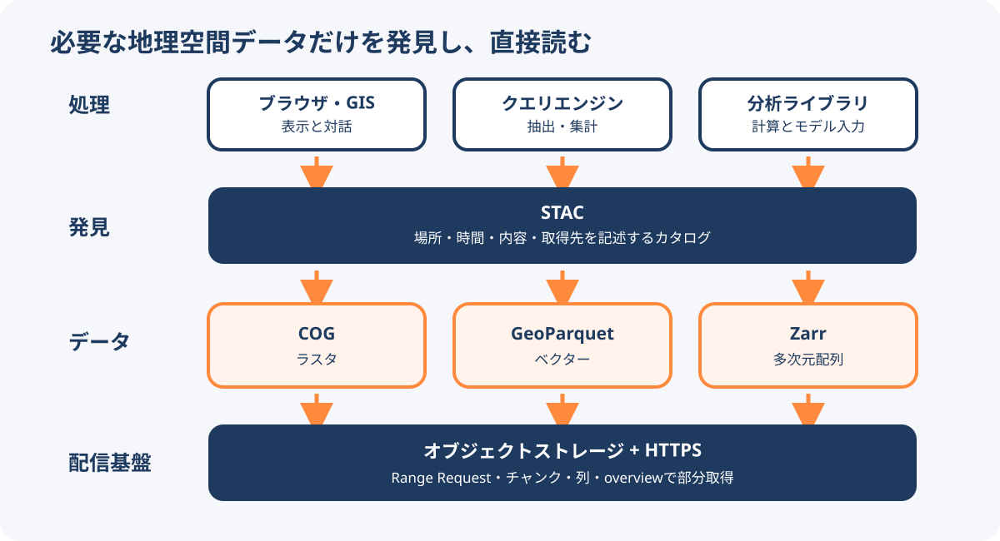
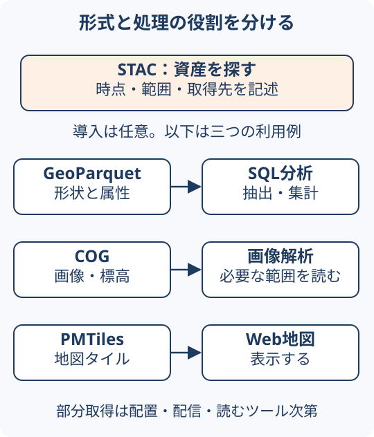

# Cloud Native Geospatial

Cloud Native Geospatial（CNG）は、地理空間データをクラウド上で扱いやすくするための、形式、配信方法、ツール、運用上の実践をまとめた考え方である。単一の規格や製品名ではない。利用者がデータ全体をダウンロードせず、必要な範囲、列、解像度、時間だけをネットワーク越しに読めるようにすることが中心にある。

<figure markdown="span">
  
  <figcaption>CNGを、発見・保存・処理の役割分担として整理した図。厳密な標準階層ではなく、GeoAIアトラスでの整理である。</figcaption>
</figure>

## 3つの役割で捉える

| 役割 | 主な技術 | 何を解決するか |
| --- | --- | --- |
| カタログ | STAC | いつ、どこに、どのようなデータがあるかを記述し、発見できるようにする |
| データ | COG、GeoParquet、Zarrなど | 必要な部分だけを読み出せるよう、ラスタ、ベクター、多次元配列を配置する |
| 処理 | ブラウザ、GIS、クエリエンジン、分析ライブラリ | 専用サーバーを必須にせず、保存先のデータへ直接問い合わせる |

この3層は固定された製品構成ではない。データの種類や用途に応じて形式と処理系を組み合わせるための整理である。STACは実データのファイル形式ではなく、データ資産を記述して探すためのカタログ仕様である。

## 目的から形式を選ぶ { #choose-format }

初めに[ベクターとラスター](vector-raster-data.md)を区別し、何を取り出して何に使うかを決める。次の四つは、同じ役割を争う形式ではない。

| 技術 | 保存・記述するもの | 主な使い道 | 混同しないこと |
| --- | --- | --- | --- |
| GeoParquet | 形状・属性の列と地理空間メタデータ | ベクターの交換、列を選ぶ分析、再処理 | SQLエンジンそのものではない |
| COG（Cloud Optimized GeoTIFF） | 部分読み取りに適した配置のラスター | 画像・標高の必要な範囲や解像度を読む | 表示用画像に限らず、分析用の値も扱う |
| PMTiles | ベクターまたはラスターの地図タイルをまとめたアーカイブ | ズーム・位置に応じたタイル配信 | 任意の属性検索や集計を行うDBではない |
| STAC | 空間・時間情報と、データ資産へのリンクなど | データを発見し、取得先を特定する | 画像・地物そのものの保存形式ではない |

GeoParquetはParquetへの地理空間表現・メタデータの仕様である。ここでは1.1.0の仕様を参照し、最新仕様であるとの主張はしない。bboxによる絞り込みは配置と読むツールの対応にも依存する。[COGP](../data/cloud-optimized-geoparquet.md)の段階表示は追加のプロファイルであり、通常のGeoParquetすべてに同じ動作を期待しない。

STACのItemは個々の資産の記述、Collectionは集合の情報、Catalogはそれらをたどる構造を担う。静的JSONのカタログもあり、STACを使うことが検索APIの稼働を意味するわけではない。検索サービスのインターフェースはSTAC APIとして区別する。

## 組み合わせの例 { #workflow }

<figure markdown="span">
  
  <figcaption>保存形式と処理・表示の役割を分けた構成例。各行は独立した例であり、すべての形式やSTACが必須ではない。GeoAIアトラス作成。</figcaption>
</figure>

店舗を分析するなら、GeoParquetから必要な列と範囲を読み、集計結果を地図へ渡す。公開用にタイルを生成してPMTilesへまとめる構成も選べる。分析用の原本と描画用タイルを分けた例は[全国メッシュのWeb配信](../methods/national-grid-web-delivery.md)を参照する。

衛星画像なら、STACで時点・範囲に合う資産を探し、COGを読む構成が考えられる。STACにリンクがあっても、その取得権限や品質が保証されるわけではない。利用条件、観測時点、欠損、[来歴](../data/geospatial-record-provenance.md)を確認する。

## 必要な部分だけを読む { #partial-reads }

CNGでは、オブジェクトストレージとHTTPSを使い、ファイルの一部や特定のチャンクを取得する。代表的な仕組みは次のとおりである。

- COGは内部タイルとoverviewを持ち、HTTP Range Requestで必要な解像度と範囲を読む。
- GeoParquetは列指向のParquetを基盤とし、必要な列やrow groupに絞った分析を行う。
- Zarrは多次元配列をチャンクへ分け、必要な領域や時間の配列だけを読む。
- STACはデータの空間・時間範囲や取得先を記述し、対象資産を絞り込む。

HTTP Rangeは、ファイルの指定したバイト範囲を取得する仕組みである。範囲指定に正常応答する場合は`206 Partial Content`と`Content-Range`を確認する。サーバーが範囲指定を無視して`200 OK`で全体を返す場合もあり、HTTP成功だけでは部分取得を確認したことにならない。

| 確認する層 | 確認点 |
| --- | --- |
| ファイル | COGの内部タイル・overview、PMTilesの索引、GeoParquetの列・行グループ・bbox情報などが目的に合うか |
| 配信 | Range指定に応答するか。取得権限・キャッシュ・配信中の版の整合性を確認する |
| 読むツール | 対象形式と版を読めるか。必要な範囲・列を要求し、不要部分を省く実装か |
| ブラウザー | 別オリジンからスクリプトで読む場合、CORSで許可されるか |

CORSはブラウザーによる別オリジンアクセスに関わる仕組みである。同一オリジンの取得や、通常のサーバー側Pythonなどに、一律の必須条件として当てはめない。一方、サーバー側でも認証やRangeへの対応は別途必要になる。

GeoParquetに変換するだけで任意の範囲検索が速くなるわけではない。空間的な並び方や統計、読むエンジンの対応によって、除外できる行グループは変わる。bboxで得た候補と[実際の形状判定](../methods/spatial-index-selection.md)も区別する。転送量・リクエスト数・待ち時間は利用環境で測定する。

## データの種類と利用者層

2026年9月14日のPSS解説は、データ層をCOGなどの画像、Zarrの多次元配列、COPCの点群、GeoParquetやFlatGeobufのベクターとして整理している。Atlasでは点群を画像ラスタとは区別し、既存図の「データ」へ対応づける。

処理層にはDuckDBやXarrayとDaskの組み合わせなどがある。AIエージェントはカタログや処理ツールを利用する側に位置づけられる。エージェントの追加によって、データ形式と処理エンジンの役割が同一になるわけではない。

## コミュニティと標準化

Cloud-Native Geospatial ForumはRadiant Earthのイニシアチブであり、ベンダー中立なイベント、文書、教育、コミュニティ運営を行う。CNG自体は標準化団体ではなく、STAC、COG、GeoParquet、Zarrの規格やコードを直接管理する組織でもない。実務コミュニティで有効性が確かめられた実践の一部が、OGCなどの標準化へつながる関係にある。

## ベクター形式の使い分け

2026年9月18日のPSSの記事は、GeoParquetとFlatGeobufを処理目的で比較している。

| 形式 | 記事が示す特徴と用途 |
| --- | --- |
| GeoParquet | 列指向のParquetを基盤に、SQL分析やクラウドDWHなど既存のデータ処理環境へつなぐ |
| FlatGeobuf | 地物単位の構造と任意の空間インデックスを使い、逐次読み込みやWeb地図表示へつなぐ |

用途ごとの傾向であり、どちらかが常に高速であるという比較結果ではない。必要な範囲だけを読むためには、ファイルの構成、配信方法、利用する処理系の対応も確認する。

## AIエージェントが利用する基盤

2026年9月20日のPSS解説は、CNGのカタログ・データ・処理の仕組みを、AIエージェントも利用する基盤として捉える。新しい利用者を加える際にも、各技術の役割を区別する。

| 役割 | 解説で関連付けられるもの |
| --- | --- |
| 場所の特徴を数値で表す | 地理空間の基盤モデルや埋め込み |
| データを記述し発見する | STACとその拡張 |
| 外部処理を呼び出す | MCPサーバー |
| 既存資産を分析・配信へつなぐ | FMEなどの変換・統合ワークフロー |

Sparkgeoのレジストリ紹介は、確認時点の本文で82サーバー・10カテゴリを挙げる。これは同社が収集した登録件数であり、地理空間MCPの総数や、全サーバーの品質・互換性を保証する数値ではない。

[空間分析への埋め込みの組み込み](../methods/spatial-embeddings.md)と[GISデータセットカタログ](../methods/gis-dataset-catalog-for-agents.md)も参照。モデルの特徴表現を使うことと、業務タスクでの精度を検証することは別に考える。

## 公共部門での運用見直し

CARTOの2026年9月30日の解説は、データを別のGIS環境へ複製する前に、既存のデータ基盤で分析する構成を検討するよう提案する。移行対象のアプリは利用実態で棚卸しし、廃止・簡素化・再構築を判断する。

既存の権限・監査を分析やAIエージェントにも引き継ぎ、日常のBI・AIツールから空間情報を使うという提案である。まず依頼を2週間記録して定型質問を見極め、専門担当者は地図の品質や正式な成果物に責任を持つ。クラウド化だけで権限管理や品質確認が不要になるわけではない。これはベンダーによる運用上の提案であり、導入効果を比較実証した結果ではない。

## 関連項目

- [POIデータを選び、分析する](../guides/poi-workflow.md)：店舗データの取得と分析へ進む。
- [画像からGIS情報を作る解析と検証](../methods/imagery-to-gis.md)：画像の取得後に何を検証するかを読む。

- [Portolan](../data/portolan.md)
- [geoparquet-io](../tools/geoparquet-io.md)
- [全国メッシュデータのWeb配信](../methods/national-grid-web-delivery.md)
- [GISデータセットカタログ](../methods/gis-dataset-catalog-for-agents.md)

## 出典

- [GeoParquet 1.1.0仕様](https://geoparquet.org/releases/v1.1.0/)（2026-10-06確認）
- [GDAL: COG driver](https://gdal.org/en/stable/drivers/raster/cog.html)（2026-10-06確認）
- [Protomaps: PMTiles Concepts](https://docs.protomaps.com/pmtiles/)（2026-10-06確認）
- [STAC Specification](https://stacspec.org/en/about/stac-spec/)（2026-10-06確認）
- [MDN: HTTP Range requests](https://developer.mozilla.org/en-US/docs/Web/HTTP/Guides/Range_requests)、[CORS](https://developer.mozilla.org/en-US/docs/Web/HTTP/Guides/CORS)（2026-10-06確認）

形式比較と構成例は公式資料を基にした学習用の整理である。今回、データ変換・配信環境の構築・性能測定は実行していない。以下の既存事例は、それぞれの確認日・検証範囲を保持している。

- [【CNG】地理データを「特別扱いしない」という発想 - ベクタ編](https://note.com/pacificspatial/n/na46641323f6f)（2026-09-18確認）

- [【CNG】レイヤーで理解するCloud Native Geospatial](https://note.com/pacificspatial/n/na2a0217a4adf)（2026-09-14公開、2026-09-15確認）

- [About CNG](https://cloudnativegeo.org/about/)（2026-09-11確認）
- [Introducing CNG](https://cloudnativegeo.org/blog/2024/09/introducing-cng/)（2026-09-11確認）
- [Cloud-Optimized Geospatial Formats Guide](https://guide.cloudnativegeo.org/overview.html)（2026-09-11確認）
- [【CNG】Cloud Native Geospatialって結局何なのか](https://note.com/pacificspatial/n/nbaab8d8f3cab)（2026-09-11確認）

- [【CNG】地図を読むのは、もう人間だけではない - 向かっている先は？](https://note.com/pacificspatial/n/n172bcc83a126)（2026-09-20公開、2026-09-21確認）
- [77+ Geospatial MCP Servers, Mapped and Categorized](https://sparkgeo.com/blog/geospatial-mcp-servers-mapped-and-categorized/)（2026-09-21確認）
- [CARTO：公共部門のGIS近代化](https://carto.com/blog/5-ways-gis-is-modernizing-public-sector/)（2026-10-01確認）
