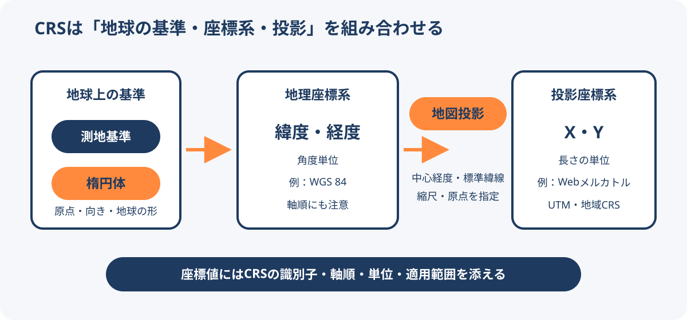

# 座標参照系（CRS）と地図投影法

座標参照系（Coordinate Reference System、CRS）は、座標値が地球上のどこを示すかを定義する仕組みである。地図投影法はCRSを構成する要素の1つであり、CRSと投影法は同義ではない。

<figure markdown="span">
  
  <figcaption>CRSを構成する要素と、緯度・経度から平面座標へ変換する流れ。</figcaption>
</figure>

## CRSを構成する要素

| 要素 | 役割 |
| --- | --- |
| 測地基準・測地参照フレーム | 地球上で原点、向き、時間的な基準を定める |
| 楕円体 | 地球の大きさと扁平な形を近似する |
| 座標系 | 座標軸の方向、順序、角度・メートルなどの単位を定める |
| 地図投影法 | 楕円体上の経緯度を平面のX・Yへ写す |
| 投影パラメーター | 中心経度、標準緯線、縮尺係数、原点、false easting/northingなどを定める |

同じ数値でもCRSが違えば場所は一致しない。座標を交換するときは、値だけでなくCRSの識別子または完全な定義を一緒に渡す。

## 地理座標系と投影座標系

### 地理座標系

地理座標系は、楕円体上の位置を緯度・経度などの角度で表す。WGS 84の地理座標系であるEPSG:4326が代表例である。

EPSG定義の軸順は緯度、経度だが、GeoJSONや一部のAPI・ライブラリは経度、緯度を使う。`4326` というコードだけで配列順を決めず、利用する形式とライブラリの仕様を確認する。

### 投影座標系

投影座標系は、地理座標系に地図投影法とパラメーターを加え、Easting・NorthingやX・Yなどの平面座標で表す。単位には通常メートルなどの長さを使う。

EPSG:3857はWGS 84 / Pseudo-Mercatorであり、Web地図の表示とタイル分割に広く使われる。メートル単位の数値を持つが、地表での距離や面積をそのまま正確に表すわけではない。

## 投影と座標変換の違い

- **投影**は、同じ測地基準上の経緯度と平面座標を行き来する処理である。
- **座標変換**は、異なる測地基準・参照フレーム間の変換も含む、より広い処理である。

実務では、元データと出力先のCRSを指定し、PROJなどのライブラリに必要な変換経路を選ばせる。EPSGコードが不明なデータへ、見た目が近いコードを推測で割り当ててはならない。

## UTM

UTM（Universal Transverse Mercator）は、横メルカトル図法を使うゾーン方式の投影座標系群である。地球を経度6度幅の60ゾーンへ分け、各ゾーンに異なる中央経線を設定する。北半球と南半球でも定義を分ける。

UTMは対象ゾーン内とその周辺でひずみを抑える。世界全体を1つのUTM座標で扱う仕組みではなく、対象地域に合うゾーンと測地基準を選ぶ必要がある。複数ゾーンにまたがる広域分析では、分析目的に合う別のCRSを検討する。

日本国内の公共測量や地域分析では、日本の平面直角座標系が選択肢になる。UTMと同様に、対象地域、測地基準、必要精度を確認して選ぶ。

## 実装時のチェックリスト

1. 入力と出力のCRSを識別できるか。
2. 緯度・経度の軸順と座標配列の順序は一致しているか。
3. 角度と長さの単位を混同していないか。
4. CRSの適用範囲に分析対象が収まっているか。
5. 距離・面積・方位のうち、計算で必要な性質を満たすか。
6. 測地基準が異なる場合、必要な座標変換を含めたか。
7. 元データ、処理、出力にCRS情報を残しているか。

## 関連項目

- [地図投影法の選び方](map-projections.md)
- [メルカトル図法](mercator-projection.md)
- [イコールアース図法](equal-earth-projection.md)

## 出典

- [PROJ: Cartographic projection](https://proj.org/en/stable/usage/projections.html)（2026-09-08確認）
- [PROJ: Universal Transverse Mercator](https://proj.org/en/stable/operations/projections/utm.html)（2026-09-08確認）
- [EPSG:4326 WGS 84](https://epsg.org/crs_4326/WGS-84.html)（2026-09-08確認）
- [EPSG:3857 WGS 84 / Pseudo-Mercator](https://epsg.org/crs_3857/WGS-84-Pseudo-Mercator.html)（2026-09-08確認）
