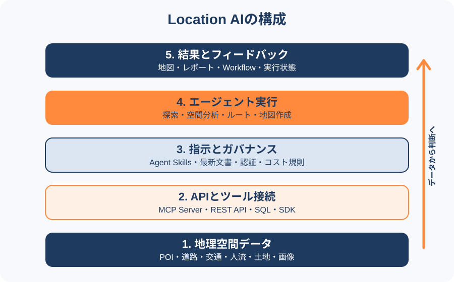

# Location AI

Location AIは、地理空間データと位置情報機能をAIエージェントから利用し、場所に関する探索、分析、判断、操作を行うための仕組みを指す呼び方である。標準化された厳密な用語ではなく、各社が示す範囲は異なる。単に地図を会話画面へ表示する機能ではなく、データ、検索・分析ツール、エージェント向けの接続、実行時の検証までを含めて捉える必要がある。

<figure markdown="span">
  
  <figcaption>Location AIを構成するデータ、接続、指示、実行、結果の関係。GeoAIアトラス作成。</figcaption>
</figure>

## 構成要素

| 層 | 役割 | 例 |
| --- | --- | --- |
| 地理空間データ | 場所と現実世界の状態を表す | POI、道路、交通、人流、土地、画像 |
| API・ツール接続 | データの検索や空間処理を実行する | REST API、SQL、SDK、MCP Server |
| 指示・ガバナンス | AIへ最新の利用方法と制約を伝える | Agent Skills、機械可読な文書、認証・コスト規則 |
| エージェント実行 | 依頼を複数の処理へ分解し、ツールを組み合わせる | 検索、到達圏、集計、ルート計算、地図作成 |
| 結果とフィードバック | 人が結果を確認し、再実行や修正につなげる | 地図、レポート、Workflow、エラー、状態の読み戻し |

MCPは主にエージェントとデータ・ツールを接続する。Agent Skillsは、どのツールをどう選び、安全性やコストをどう確認するかという手順を補う。同じ「AI対応」であっても役割は異なるため、接続できることと、正しく再現可能に実行できることを分けて評価する。

## 2026年9月時点で確認した例

- MapboxはLocation AIの構成として、位置検索やルート計算などを公開するMCP Server、開発支援用のDevKit MCP Server、Agent Skills、Feedback Agent、MapGPTを挙げている。
- xMapはPOI、人流、道路交通、土地などのデータを、MCP、REST API、Python SDK、SQL、ダウンロードで提供するとしている。件数や解像度などはベンダー公表値であり、地域、期間、更新頻度、生成方法を導入前に確認する必要がある。
- TomTom Orbisについては、位置情報をAI向けの空間知識レイヤーとして扱い、API、MCP Server、Agent Toolkitから利用する構想が報じられている。現時点の情報源は第三者記事であるため、機能や提供条件はTomTomの最新資料で再確認する。
- CARTO MCP Serverは、権限を引き継いだ空間分析と地図作成をエージェントへ公開し、処理を再利用可能なWorkflowとして残す。

## 評価するときの確認点

- データの対象地域、更新頻度、空間・時間解像度、ライセンスを確認する。
- LLMの学習済み知識ではなく、実際のAPIやデータセットから場所情報を取得しているかを確認する。
- 読み取り、書き込み、管理操作の権限を分け、操作履歴を監査できるようにする。
- 地図や集計が空でも成功扱いにならないよう、スキーマ検証、エラー、件数、表示状態をエージェントへ返す。
- 個人に関係する位置情報では、同意、利用目的、集計方法、再識別リスク、保存期間を確認する。

## 関連項目

- [ロケーションインテリジェンス](location-intelligence.md)
- [AIが扱いやすい地理空間開発環境](../methods/ai-ready-geospatial-development.md)
- [CARTO MCP Server](../tools/carto-mcp-server.md)
- [知識グラフとLLMエージェントによる地理空間データ探索](../methods/intelligent-geospatial-data-discovery.md)

## 出典

- [Location AI at Mapbox](https://docs.mapbox.com/help/getting-started/location-ai/)（2026-09-10確認）
- [xMap](https://www.xmap.ai/ja)（2026-09-10確認）
- [TomTom: location intelligence an important growth market](https://www.marketscreener.com/news/tomtom-location-intelligence-an-important-growth-market-ce785bd8db81f32d)（2026-09-10確認、第三者記事）
- [Geospatial Analysis in Claude with the CARTO MCP Server](https://carto.com/blog/geospatial-analysis-claude-mcp-server/)（2026-09-10確認）
