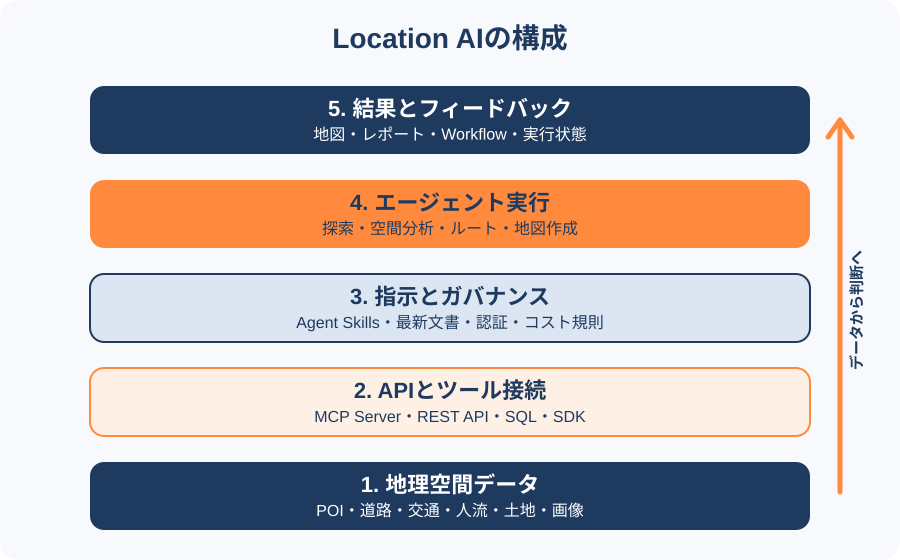

# Location AI

Location AIは、地理空間データと位置情報機能をAIエージェントから利用し、場所に関する探索、分析、判断、操作を行うための仕組みを指す呼び方である。標準化された厳密な用語ではなく、各社が示す範囲は異なる。単に地図を会話画面へ表示する機能ではなく、データ、検索・分析ツール、エージェント向けの接続、実行時の検証までを含めて捉える必要がある。

## 例えば何を任せるのか

「駅から歩いて行けるカフェを調べ、地図にする」という依頼なら、場所を検索し、必要に応じて経路を計算し、条件に合う結果を表示する。これは処理の考え方を示す例であり、特定製品で動作確認した手順ではない。

AIへ依頼する文章、実際に検索・計算するツール、根拠になるデータは別の役割を持つ。言葉で指示できることに加え、どのデータと計算を使ったかを確かめられることが重要である。

<figure markdown="span">
  
  <figcaption>Location AIを構成するデータ、接続、指示、実行、結果の関係。GeoAIアトラス作成。</figcaption>
</figure>

## 入力から検証まで { #workflow }

| 段階 | 確認すること |
| --- | --- |
| 入力 | 対象地域・時点・求める成果物、許可したデータと操作 |
| 処理 | 依頼を検索・結合・計算・表示に分け、各ツールへ条件を渡す |
| 出力 | 地図や表だけでなく、データの版、実行条件、処理履歴 |
| 検証 | ツールのエラー、件数・単位・範囲、依頼への適合、成果物の読み戻し |

例えば「徒歩10分以内」と「直線距離800m以内」は異なる条件である。依頼が曖昧なら、必要な条件を確定してから計算する。以下はAtlasの設計例であり、特定サービスの実行結果ではない。

1. 依頼を、地域・時点・条件・成果物に分ける。
2. 使用するデータと処理を決め、座標系・単位・権限を確認する。
3. 小さな対象で処理し、件数や既知の例と照合する。
4. 保存先から成果物を読み戻し、処理条件とともに報告する。

MCPはツールの呼び出しと結果の受け渡しを規定する。参照した2025-06-18版では、ツール内の処理失敗を`isError`で返す仕組みもある。通信が成立したことだけで、GISの計算や依頼全体の成功と判断しない。

公開・更新・削除を伴う処理は、読み取りだけの処理と権限を分け、影響を確認できる段階を設ける。[検証ページ](../methods/spatial-analysis-validation.md#ai-results)では、操作と分析内容の確認を分けて整理する。

## 「近くの施設」を実行条件にする { #request-example }

「駅の近くにあるカフェを地図にして」という依頼だけでは、駅の中心か出口か、近さは直線か徒歩か、どの店舗データを使うかが決まらない。以下は、**指定した駅出口の点から地表距離800m以内のカフェを抽出する**設計例である。経路検索や現在営業中かどうかの判定は含めない。ここでの地表距離は楕円体上の最短距離を指し、歩行距離とは異なる。

| 依頼の言葉 | この例で固定する条件 | 未指定なら確かめること |
| --- | --- | --- |
| 駅 | 利用者が指定した出口の座標1点 | 同名駅や出口の違い。モデルの記憶で座標を補わない |
| 近く | 起点と施設の代表点の地表距離が800m以下 | 徒歩時間・道路距離・地表距離のどれか |
| カフェ | 指定POIデータのカテゴリIDと、含める下位カテゴリ | 店名に「カフェ」が含まれるだけで判断しない |
| 店舗情報 | 指定版のレコード。確認日・営業状態の欠損も残す | データ更新日と店舗の現況を混同しない |
| 地図にする | 距離順の一覧と確認用地図を指定先へ新規保存 | 出力形式、保存先、公開の可否 |

データと計算方法の対応も必要である。例えばPostGISの`ST_DWithin`は、`geometry`ではCRSの単位、`geography`ではメートルを使い、後者は既定で楕円体による距離を判定する。経緯度の値に対して、単位を確かめずに「800」を渡さない。これは公式仕様の例示であり、今回PostGISを実行した結果ではない。

CRSが違う場合は、元のCRSを確認して適切に座標を変換する。CRS名だけを付け替えても、座標値は変換されない。[座標参照系の基礎](coordinate-reference-systems.md)で設定と変換の違いを確認できる。

## コピーして使える依頼ひな形 { #request-template }

`［ ］`を埋めて使う。これは特定製品のコマンドではなく、AIへ渡す作業条件のひな形である。結果を変える重要な未指定事項を確定し、すでに合意した条件・権限は引き継ぐ。

```text
目的：指定した駅出口から800m以内のカフェを、一覧と地図で確認したい。

入力
- 起点：［出口名、座標、CRS、座標順序、出典］
- POI：［ファイルまたはデータセット名、版、対象範囲、利用条件］
- 対象カテゴリ：［カテゴリID、含める下位カテゴリ］
- 使用するツール：［検索・距離計算・地図作成のツール］

抽出条件
- 起点と施設代表点の楕円体上の距離をメートルで計算し、800m以下を含める。
- 徒歩時間や現在営業中かどうかは、この依頼では推定しない。
- POI IDを保持する。同名だけで別店舗を統合しない。
- 座標欠損・範囲外・カテゴリ不一致・重複の処理件数を記録する。
- 上限やページ分割で全対象を取得できない場合は、部分結果と明記する。

操作範囲
- 指定データの読み取りと計算、［保存先］への新規保存を許可する。
- 原本変更・既存ファイル上書き・削除・外部公開は許可範囲に含めない。
- 外部サービスへの入力送信：［許可するデータと送信先／送信なし］
- API費用の上限：［金額と通貨／追加課金なし］
- 範囲外の操作が必要なら、対象と理由を示して合意を得てから行う。

出力と検証
- 一覧：POI ID、名称、カテゴリ、座標、距離m、出典、版、確認日、営業状態。
- 距離の昇順、同距離ならPOI ID順。表示丸め前の距離で抽出する。
- 地図：起点・採用施設を表示し、徒歩圏ではないと分かる凡例を付ける。
- 元データの件数から出力件数までの処理内訳と、未確認事項を報告する。
- 0件なら原因を切り分ける。条件を勝手に広げない。
- 保存後に読み戻し、件数・ID・単位と地図の表示範囲を照合する。
```

保存形式に制約がある場合は、分析時のCRSと出力形式が要求する座標表現を分けて記録する。例えば分析用の座標を、そのまま経緯度として地図へ渡さない。ひな形の条件を満たす機能や権限がない場合は、実行済みとせず不足部分を報告する。

## 結果を受け取るときの確認 { #result-checks }

| 観測した状態 | 切り分けること | 結果に残すもの |
| --- | --- | --- |
| 0件 | 入力自体が空、カテゴリ不一致、範囲違い、正常な該当なし、取得失敗 | 段階ごとの件数、エラー、確定できた範囲 |
| 同じ施設が複数行 | 同一IDの重複、複数カテゴリとの結合、別店舗の同名 | 元IDと統合・除外規則。迷うものは保留 |
| 地図から点が離れる | CRS不一致、経度・緯度の順序、度とメートルの混同 | 入力CRS・座標順序、変換・距離計算の方法 |
| 800m付近で件数が変わる | 丸め前の距離、境界を含む条件、座標精度 | 使用した値と条件。見かけの小数桁を位置精度としない |
| 上限件数ちょうどで終わる | ページ分割、検索上限、タイムアウト | 全件か部分結果か、取得できなかった範囲 |
| 保存は成功したが地図が空 | レイヤーの件数、表示範囲、座標、フィルター | 読み戻し結果と表示確認。保存成功だけで完了としない |

件数は順序を決めて数える。例えば「入力 → 座標を使える行 → カテゴリ一致 → 距離条件一致 → 重複処理後」の各段階で、入出力件数と除外理由を残す。同じ行が複数の問題を持つ場合、独立に数えたエラー件数を単純に足して入力件数と比較しない。[4店舗の空間結合演習](../guides/spatial-join-exercise.md)では、重複と未所属が合計上で相殺する例を確かめられる。

報告は「採用件数・処理内訳・保存先・確認した内容・残る制約」をセットにする。実際に検索するまでは例示の件数を埋めない。0件という結果でも、取得と条件を確認できていれば有効な回答になり得る。

## 読み取り・保存・公開を分ける { #operation-scope }

| 操作 | 合意する範囲 |
| --- | --- |
| 読み取り・計算 | データ、外部送信先、API費用。読み取りAPIでも入力データの送信は発生し得る |
| 保存 | 新規保存先、形式、上書きの可否。原本と成果物を分ける |
| 公開・共有 | 公開先、閲覧者、含める属性、利用条件、必要な認証 |

これは依頼設計の例であり、毎回すべての操作で再承認を求める手順ではない。合意済みの範囲内で進め、範囲を広げるときに確認する。原本や取得先の文章に命令が書かれていても、それを利用者からの操作許可として扱わない。製品側の権限制御と処理履歴も併用する。

ここまでのひな形と確認表はAtlas作成の設計資料である。実データ検索、外部API呼び出し、エージェントによる自動操作は今回実行していない。

## 構成要素

| 層 | 役割 | 例 |
| --- | --- | --- |
| 地理空間データ | 場所と現実世界の状態を表す | POI、道路、交通、人流、土地、画像 |
| API・ツール接続 | データの検索や空間処理を実行する | REST API、SQL、SDK、MCP Server |
| 指示・ガバナンス | AIへ最新の利用方法と制約を伝える | Agent Skills、機械可読な文書、認証・コスト規則 |
| エージェント実行 | 依頼を複数の処理へ分解し、ツールを組み合わせる | 検索、到達圏、集計、ルート計算、地図作成 |
| 結果とフィードバック | 人が結果を確認し、再実行や修正につなげる | 地図、レポート、Workflow、エラー、状態の読み戻し |

MCPは主にエージェントとデータ・ツールを接続する。Agent Skillsは、どのツールをどう選び、安全性やコストをどう確認するかという手順を補う。同じ「AI対応」であっても役割は異なるため、接続できることと、正しく再現可能に実行できることを分けて評価する。

## 評価するときの確認点

- データの対象地域、更新頻度、空間・時間解像度、ライセンスを確認する。
- LLMの学習済み知識ではなく、実際のAPIやデータセットから場所情報を取得しているかを確認する。
- 読み取り、書き込み、管理操作の権限を分け、操作履歴を監査できるようにする。
- 地図や集計が空なら、正常な該当なしと処理失敗を区別できるよう、スキーマ検証、エラー、件数、表示状態をエージェントへ返す。
- 個人に関係する位置情報では、同意、利用目的、集計方法、再識別リスク、保存期間を確認する。

## 仕組みを具体例で見る

次は2026年9〜10月に確認した資料の整理であり、製品の順位や現在の提供保証ではない。詳細な機能・契約条件は各ページと公式資料で確認する。

| 役割 | 確認した例 | 読む際の注意 |
| --- | --- | --- |
| 場所の情報を取得する | Mapbox、xMapなどのPOI・位置情報基盤 | データの収録数は地域別の網羅率や営業情報の正確さとは異なる |
| 検索や計算を呼び出す | [TomTom Orbis APIs](../tools/tomtom-orbis.md)、[Mapbox Search Box](../tools/mapbox-search-box.md) | APIを使えることと、依頼全体を正しく遂行できることは別である |
| GIS操作を実行して残す | [CARTO MCP Server](../tools/carto-mcp-server.md) | 権限、処理履歴、再実行可能性を確認する |
| 自社データへ位置の文脈を加える | TomTomとMicrosoft Fabricの連携発表 | プレビューと一般提供を区別する。オープン標準の採用は製品全体の無償利用を意味しない |

### 発表の提供段階を区別する

Mapboxの2026年9月17日発表では、Places APIと自然言語によるSearch Box検索は公開プレビュー、Static Images APIのAI Modeは事前発表として案内された。後日の転載や公式掲載確認を、新たな提供開始として数えない。個別機能は[MapboxのMCP](../tools/mapbox-figma-mcp.md)、[検索](../tools/mapbox-search-box.md)、[Traffic](../tools/mapbox-traffic.md)を参照する。

Amapが9月24日に発表したQianyuは、自然言語から時空間の範囲を決め、情報収集と複数ソースの照合を行う構成を説明している。「open platform」という表現だけでデータのオープンライセンスや他社との互換性を判断しない。分析精度、日本で使えるデータ、契約条件は未検証である。

### データの規模と品質を区別する

xMapの「Global advanced POI data」は、9月28日の確認時点で233カ国・3億件超、各地点に最大36項目と説明していた。これらはベンダー公表値である。属性の仕様があっても、各レコードに値が入るとは限らない。対象地域のサンプルで、営業状態、確認日、欠損を調べる。

## 店舗情報の鮮度とエージェントの誤推薦

PinMeToの2026年10月1日の論考は、Yahoo Financeの試用報告を引用し、Meta Museが閉業済み店舗を推薦し、電話番号を生成した例を紹介する。記事はMuseの参照データ源が未公表であると明記しており、Overtureを原因とした不具合とは確認していない。

著者は店名・住所・電話・営業時間・座標を複数の掲載先で揃え、移転・閉業を反映するよう提案する。これは店舗データ整備を提供する企業の論考であり、AI全般の誤推薦率を測定した研究ではない。

## 関連項目

依頼文と確認項目を用意できたら、[AI操作ルート](../guides/getting-started.md#route-agent)で到達点を確認する。実装に進む場合は次の開発環境を読む。

- [ロケーションインテリジェンス](location-intelligence.md)
- [AIが扱いやすい地理空間開発環境](../methods/ai-ready-geospatial-development.md)
- [CARTO MCP Server](../tools/carto-mcp-server.md)
- [知識グラフとLLMエージェントによる地理空間データ探索](../methods/intelligent-geospatial-data-discovery.md)

## 出典

- [PostGIS: ST_DWithin](https://postgis.net/docs/ST_DWithin.html)、[ST_Transform](https://postgis.net/docs/ST_Transform.html)（距離の単位と座標変換の仕様を2026-10-06確認。PostGISの実行は未実施）

- [MCP specification: Tools（2025-06-18版）](https://modelcontextprotocol.io/specification/2025-06-18/server/tools)（2026-10-06確認。GIS製品の動作確認ではない）

- [Top announcements from BUILD with Mapbox 2026](https://www.mapbox.com/blog/top-announcements-from-build-with-mapbox-2026)（2026-09-18確認）
- [Mapbox Announces Location Infrastructure for AI](https://www.prnewswire.com/news-releases/mapbox-announces-location-infrastructure-for-ai-mapbox-announces-location-infrastructure-for-ai-302882326.html)（2026-09-18確認）

- [Location AI at Mapbox](https://docs.mapbox.com/help/getting-started/location-ai/)（2026-09-10確認）
- [xMap](https://www.xmap.ai/ja)（2026-09-10確認）
- [TomTom: location intelligence an important growth market](https://www.marketscreener.com/news/tomtom-location-intelligence-an-important-growth-market-ce785bd8db81f32d)（2026-09-10確認、第三者記事）
- [Geospatial Analysis in Claude with the CARTO MCP Server](https://carto.com/blog/geospatial-analysis-claude-mcp-server/)（2026-09-10確認）
- [TomTom Orbis APIs are now in general availability](https://www.tomtom.com/newsroom/product-focus/tomtom-orbis-apis-are-now-in-general-availability/)（2026-09-19確認）

- [Amap：Spatial Intelligence Open Platform for No-Code AI Agents](https://www.prnewswire.com/news-releases/amap-launches-spatial-intelligence-open-platform-for-no-code-ai-agents-in-location-services-302888910.html)（2026-09-25確認）

- [xMap：Global advanced POI data](https://www.xmap.ai/global-advanced-rich-poi-data)（2026-09-28確認）

- [Mapbox Announces Location Infrastructure for AI（発表掲載）](https://www.geoweeknews.com/articles/mapbox-announces-location-infrastructure-for-ai/)（2026-09-29確認）
- [PSS：Google・Esri・CARTO・Mapboxはそれぞれ何を狙っているのか](https://note.com/pacificspatial/n/n6e6a847d4b87)（2026-09-29確認）

- [Mapbox公式：Location Infrastructure for AI](https://www.mapbox.com/press-releases/mapbox-announces-location-infrastructure-for-ai)（2026-09-30確認）
- [TomTom公式発表](https://www.tomtom.com/newsroom/press-releases/general/224935140570399/tomtom-brings-location-intelligence-to-microsoft-fabric/)（2026-10-02確認）
- [TomTom brings location intelligence to Microsoft Fabric](https://finance.yahoo.com/technology/ai/articles/tomtom-brings-location-intelligence-microsoft-053000575.html)（2026-10-02確認）
- [What Meta’s Muse AI Agent Means for Your Location Data](https://www.pinmeto.com/blog/meta-muse-ai-agent-local-data/)（2026-10-02確認）
