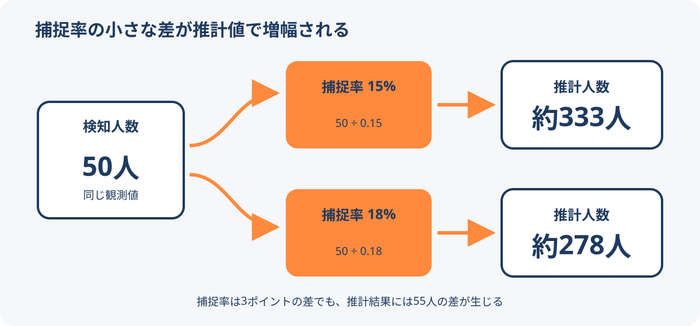

# 人流データの計測誤差と推計誤差

人流データの誤差は、機器や取得方法が人を取りこぼし・過剰検知する「計測誤差」と、観測できた一部から全体を求める「推計誤差」に分けて考える。推計値だけを見ても、元の観測数や補正方法が分からなければ精度を判断できない。

<figure markdown="span">
  
  <figcaption>捕捉率の小さな違いが、割り算による拡大推計で増幅される例。</figcaption>
</figure>

## 計測するときの誤差

計測方法ごとに、観測できる対象と誤差の方向が異なる。

| 方法 | 主な取りこぼし・過剰検知の要因 |
| --- | --- |
| カメラ | 逆光、夜間、傘、マスク、遮蔽、画角 |
| LiDARなどのセンサー | 傘や走行者の判別、人・自転車・動物の誤認、設置位置 |
| Wi-Fiパケット | Wi-Fiが無効な端末の未検知、MACアドレスのランダム化 |
| スマートフォン位置情報 | アプリ利用者への偏り、測位・通信条件、観測間隔 |

計測条件は時間によって変わる。天候、照明、機器設定、設置場所などを記録し、精度の検証時に観測値と結び付けられるようにする。

## 推計するときの誤差

一部しか観測できない場合は、捕捉率などを使って母集団を推計する。

```text
推計人数 = 検知人数 ÷ 捕捉率
```

50人を検知した場合、捕捉率15%なら約333人、18%なら約278人になる。捕捉率は3ポイントしか違わないが、推計結果には55人の差が生じる。捕捉率が小さいほど、率の誤差が推計値へ大きく伝わる。

通信事業者やアプリ由来の製品では、提供値が実測件数ではなく拡大推計後の人数である場合がある。推計式、補正係数の作成方法、地域・時間帯・属性ごとの捕捉率、丸めや秘匿処理を確認する。

## 利用前に確認すること

1. 値は計測値、推計値、どちらを含む値か。
2. 取得方法は何で、観測できない人や状況は何か。
3. 重複除去と過剰検知の補正をどう行ったか。
4. 捕捉率や拡大係数を、どの実測値・統計と照合して作ったか。
5. 地域、時間帯、天候、端末属性によって誤差が変わるか。
6. 可能なら歩行者調査や既存統計と小規模に比較し、乖離の方向を確認したか。

## 関連項目

- [人流データの種類](human-flow-data-types.md)
- [人流データの時間処理と集計定義](../methods/human-flow-time-processing.md)
- [日本で使える人流データ](human-flow-data-sources-japan.md)

## 出典

- [国土交通省「地域課題解決のための人流データ利活用の手引き 改訂版v1.2」](https://www.mlit.go.jp/tochi_fudousan_kensetsugyo/chirikukannjoho/content/001733098.pdf)（2026-09-08確認）
- [【人の動きを測る】第12回: 人流データの誤差の正体](https://note.com/pacificspatial/n/n640ded7f31f3)（2026-09-08確認）
