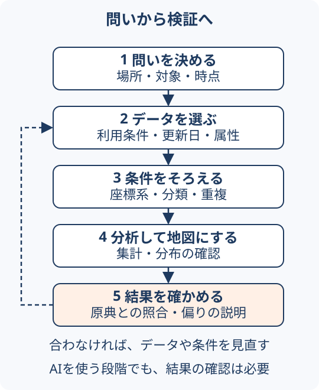

# 初めてのGeoAI

地図・位置情報とAIを学ぶ入口である。最初から製品名を覚えるより、「どの場所について、何を知りたいか」を一つ決めると、必要なデータと道具を選びやすい。

プログラミングは前提にしない。まず説明と図から判断基準をつかみ、実装が必要になったときに各ページの実践記事や公式資料へ進めばよい。

## 目的に合わせて3ルートから選ぶ { #learning-routes }

一つのルートから始め、分からない言葉だけ基礎へ戻ればよい。ここでの到達点は学習内容を確かめる目安であり、製品や実データを操作できたことの保証ではない。

| ルート | 向いている人 | 最初に読む | 到達点 |
| --- | --- | --- | --- |
| [基礎理解](#route-foundations) | GIS・GeoAIの関係をつかみたい | [GeoAIの全体像](../concepts/geoai-overview.md) | 分析と操作支援の違いを説明し、目的に合う手法を選べる |
| [データ分析](#route-analysis) | 地図データを集計し、結果を確かめたい | [空間結合の基本](../methods/spatial-join-and-aggregation.md) | 重複・未所属と評価指標を確認し、結果の限界を説明できる |
| [AI操作](#route-agent) | GIS操作をAIに依頼したい | [依頼を条件へ分ける例](../concepts/location-ai.md#request-example) | 対象・距離・権限・出力・検証を記した依頼文を作れる |

### 1. 基礎理解：手法を選べるようになる { #route-foundations }

1. [GeoAIの全体像](../concepts/geoai-overview.md)で、AIによる分析とGIS操作支援を分ける。
2. [ベクターとラスター](../concepts/vector-raster-data.md)で、点・線・面と画素の違いをつかむ。
3. [座標と距離・面積](../concepts/coordinate-reference-systems.md#measurement)を確認する。
4. [手法比較](../concepts/geoai-overview.md#choose-method)に戻り、やりたいことに合う入力・出力・検証を選ぶ。

**確認すること**：「カフェを数える」「画像から建物を抽出する」「GIS操作を任せる」の違いを説明できるか。さらに体系的に読むなら[基礎5テーマ](#foundations)、具体的に試すなら次のデータ分析へ進む。

### 2. データ分析：件数と評価を確かめる { #route-analysis }

1. [空間結合の基本](../methods/spatial-join-and-aggregation.md) → [4店舗の演習](spatial-join-exercise.md)で、未所属と重複を数える。
2. [画像解析の評価](../methods/imagery-to-gis.md#workflow) → [16画素の演習](imagery-evaluation-exercise.md)で、誤検出と見逃しを分ける。
3. [検証と適用範囲](../methods/spatial-analysis-validation.md)で、何を確認でき、何が未確認かを整理する。

二つの演習は**手計算だけでも取り組める**。Pythonでの照合は任意で、環境と実行範囲は各演習に記載している。店舗の分析が目的なら1から[POIの実データ選び](poi-workflow.md)へ、画像の評価が目的なら2から始めてもよい。

**確認すること**：合計件数が合うだけで正しいと言えない理由と、適合率・再現率の違いを説明できるか。予測へ進む場合は[埋め込みの検索と予測](../methods/spatial-embeddings.md#search-vs-prediction)を読む。

### 3. AI操作：条件と確認方法を依頼文にする { #route-agent }

1. [駅周辺の施設を探す例](../concepts/location-ai.md#request-example)で、曖昧な言葉を実行条件へ分ける。
2. [依頼ひな形](../concepts/location-ai.md#request-template)に、対象データ・距離・出力・操作範囲を記入する。
3. [結果確認表](../concepts/location-ai.md#result-checks)で、0件・重複・座標のずれ・部分取得を確認する方法を決める。

**確認すること**：依頼文を別の人に渡しても、同じ条件と許可範囲で作業できるか。このルートは依頼設計までを扱う。実際に接続・実装する段階では[AI向け開発環境](../methods/ai-ready-geospatial-development.md)と利用するツールの公式資料へ進む。

## まず押さえる言葉

| 言葉 | このサイトで扱う意味 | 身近な例 |
| --- | --- | --- |
| GIS | 位置に結び付いた情報を管理・分析・表示する仕組み | 避難所と浸水区域を重ねて見る |
| POI | 店舗・施設など、関心の対象になる場所の情報 | カフェの名前、位置、カテゴリ |
| 地物と属性 | 地図上の対象と、それに付く説明 | 店舗の点と、名称・業種 |
| レイヤー | 同じ種類の地物をまとめた表示の単位 | 店舗、道路、浸水区域を別々に重ねる |
| 座標参照系（CRS） | 数値の座標が地球上のどこを指すかを決める仕組み | 緯度・経度と平面上のメートル座標 |
| GeoAI | 地理空間データとAI・機械学習を組み合わせる取り組み | 衛星画像の分類や、場所の情報を使う予測 |

## 一つの目的を、五つの段階に分ける

例えば「駅の周辺にどのような店が多いか」を調べる場合は、次の順で進める。

1. **問いを決める**：駅からの範囲、対象業種、調べる時点を決める。
2. **データを選ぶ**：POIの利用条件、更新日、属性を確認する。
3. **条件をそろえる**：座標系、カテゴリ、重複、取得漏れを確認する。
4. **分析して地図にする**：件数や密度を集計し、分布を見る。
5. **結果を確かめる**：元データと照合し、欠損や収録の偏りを説明する。

<figure markdown="span" id="analysis-cycle">
  
  <figcaption>検証で見つかった不足を、データ選びや条件の整理へ戻して改善する。本文の手順を基にGeoAIアトラス作成。</figcaption>
</figure>

単純な集計や地図表示にも価値がある。AIを組み合わせる場合も、この流れのどの段階を任せるかを決め、出力を確かめる。店舗数だけから人気や売上を結論付けることはできない。

## 基礎を五つのテーマで学ぶ { #foundations }

点・線・面と画像の違いから確認したい場合は、[ベクターとラスター](../concepts/vector-raster-data.md)を先に読む。5テーマの後は、[空間索引](../methods/spatial-index-selection.md)で検索の効率化、[データの来歴](../data/geospatial-record-provenance.md)で再現に必要な記録へ進める。

| 順序 | 読むページ | 読み終えたら確かめること |
| --- | --- | --- |
| 1 | [GeoAIの全体像](../concepts/geoai-overview.md) | AIでデータを分析することと、GISを操作させることを分けられる |
| 2 | [座標参照系と距離・面積](../concepts/coordinate-reference-systems.md#measurement) | CRSの設定と変換、平面と曲面の計算を区別できる |
| 3 | [空間結合と集計の基本](../methods/spatial-join-and-aggregation.md) | 境界上の点や複数所属が件数に与える影響を説明できる |
| 4 | [予測・説明・因果の違い](../concepts/geographic-model-reasoning.md#prediction-explanation-causality) | 同じ回帰モデルでも問いと検証が変わることを説明できる |
| 5 | [分析結果の検証と適用範囲](../methods/spatial-analysis-validation.md) | 利用する地域・時点に合わせ、何を照合すべきか挙げられる |

基礎5テーマは参照用の順序である。すべてを読了する前でも、[3ルート](#learning-routes)から必要な演習や依頼例へ進める。

## 別の目的へ進む

人流・Web地図・防災・保存形式などは、[知識マップの目的別案内](../index.md#by-purpose)から選ぶ。ここでは読む順序を案内し、手法の詳しい説明・出典は各ページにまとめる。

## 道具を選ぶ前に

「ライブラリ」はプログラムへ組み込む部品、「Webサービス」はブラウザーやAPIを通して利用するサービスである。名前が並んでいても、準備や操作方法は同じではない。各ページでコードの必要性、入力データ、出力、利用条件を確かめる。

データがオープンであること、サービスに無料枠があること、自由に再配布できることは別の条件である。また、論文の実験結果、製品の発表、実際に動作確認した結果も分けて読む。

## この案内の参照先

このページはAtlasの既存解説をつなぐ編集上の案内である。技術の詳細と出典・確認日は、上記の各ページに記載している。全項目は[知識マップ](../index.md)から探せる。
