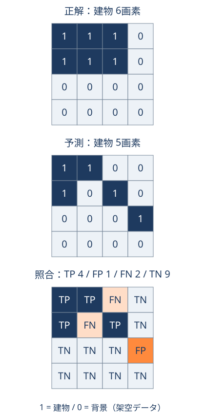

# 16画素で試す画像分類の評価

「建物として塗った場所は正しいか」「建物を見逃していないか」を、小さな架空画像で確かめる演習である。図を数えるだけでも進められ、Pythonでは同じ入力を計算できる。**実際の衛星画像や学習済みモデルは使わず、評価方法を学ぶために正解・予測を手作りしている。**

前提は[画像解析と検証](../methods/imagery-to-gis.md)。ここでは、各画素を建物か背景に分類する二値の領域分割を扱う。建物を一棟ずつ検出する評価とは区別する。

## 1. 正解と予測を重ねる { #masks }

4行×4列の同じ格子を用いる。`1`は建物、`0`は背景である。すべて同じ面積の画素で、欠損はない。これは説明用の格子であり、実在地域の座標・解像度は持たない。実データなら正解と予測の位置、画素サイズ、観測時点を先に合わせる。

<figure markdown="1">

<figcaption>同じ16画素を正解・予測・照合の順に表示。GeoAIアトラス作成。図は実行コードの入力から生成する。</figcaption>
</figure>

図の代わりに数字で確認する場合、上から順に読む。

```text
正解          予測
1 1 1 0       1 1 0 0
1 1 1 0       1 0 1 0
0 0 0 0       0 0 0 1
0 0 0 0       0 0 0 0
```

## 2. 四つの結果を数える

建物を「陽性」と呼ぶ。以下の個数は建物の棟数ではなく、画素数である。

| 記号 | 正解 | 予測 | 意味 | 画素数 |
| --- | --- | --- | --- | ---: |
| TP（真陽性） | 建物 | 建物 | 正しく見つけた | 4 |
| FP（偽陽性） | 背景 | 建物 | 誤検出 | 1 |
| FN（偽陰性） | 建物 | 背景 | 見逃し | 2 |
| TN（真陰性） | 背景 | 背景 | 背景を正しく判定 | 9 |

まず合計が16画素になるか確かめる。正解の建物は `TP + FN = 6`、予測した建物は `TP + FP = 5` である。

## 3. 問いに応じて指標を読む { #metrics }

| 指標 | この例の計算 | 答えたい問い |
| --- | --- | --- |
| 適合率（precision） | 4 ÷ (4 + 1) = **80.0%** | 建物と予測した画素のうち、正しかった割合は？ |
| 再現率（recall） | 4 ÷ (4 + 2) ≈ **66.7%** | 正解の建物画素のうち、見つけた割合は？ |
| IoU（共通部分 ÷ 和集合） | 4 ÷ (4 + 1 + 2) ≈ **57.1%** | 建物領域がどれだけ重なるか？ |
| 正解率（accuracy） | (4 + 9) ÷ 16 = **81.25%** | 背景も含む全画素のうち、正しかった割合は？ |

ここでのIoUは建物クラスだけの値であり、複数クラスの平均ではない。同じ面積の画素なので、共通部分4画素と和集合7画素の比を面積比として扱える。

正解率は背景の正解も含む。この例で全部を背景と予測しても、10 ÷ 16 = 62.5%となるが、建物は一つも見つからない。どの指標を重視するかは、誤検出と見逃しが用途へ与える影響から決める。

予測した建物が0画素なら適合率の分母が0になる。正解の建物が0画素なら再現率も同様である。下のコードは未定義の値を `None`（JSONでは `null`）にする。これは本演習の方針で、ライブラリの既定動作と同じとは限らない。集計時も黙って0や1へ置き換えない。

## 4. Pythonで照合する { #run }

[imagery_evaluation.py](../../assets/exercises/imagery_evaluation.py)を保存し、そのフォルダーで次を実行する。Python 3.11以上を想定し、追加パッケージやAPIキーは不要である。

```sh
python imagery_evaluation.py
```

JSONでPythonの版、16画素の計数・各指標、最後に `"check": "PASS"` を表示する。期待値は `TP=4, FP=1, FN=2, TN=9`、適合率 `0.8`、再現率 `0.666…`、IoU `0.571…`、正解率 `0.8125` である。通信やファイル書き込みは行わない。

コード中の `TRUTH` と `PREDICTION` が図の入力である。固定された期待値と結果を照合するため、入力を編集して計数・指標が期待値と異なれば、検査は失敗する。別の例を試す際は、先に手計算し、`expected` もその期待値へ変更する。

## 5. 画素の評価と建物の評価を分ける

隣り合う二棟の間を誤って塗りつぶした場合、間の数画素だけが誤りでも、二棟が一つの領域につながることがある。画素の指標が高くても、棟数や建物ごとの形状が正しいとは限らない。

建物単位なら、正解・予測それぞれの建物IDを持ち、どれとどれを対応させるか決める。例えばIoUのしきい値と一対一の対応規則が必要になる。しきい値を一つ示すだけでは、重複検出や分割・結合の扱いは決まらない。この演習のコードは物体の対応付けを実装していない。

PASSは架空例の計算確認であり、AIの性能や他地域での精度を保証しない。実データでは、ラベルの誤り、雲やNoData、位置ずれ、対象の大きさ、地域・時期の違いも点検する。

## 次に読む

[データ分析ルート](getting-started.md#route-analysis)で到達点を確認し、以下から次の課題を選ぶ。

- [4店舗の空間結合演習](spatial-join-exercise.md)：合計が合っていても対応が誤る例を確認する。
- [分析結果の検証と適用範囲](../methods/spatial-analysis-validation.md)：未使用の地域・時点での評価へ進む。
- [ベクターとラスター](../concepts/vector-raster-data.md)：画素と地物の表現の違いを確認する。

## 出典と実行範囲

- scikit-learn公式の[適合率](https://scikit-learn.org/stable/modules/generated/sklearn.metrics.precision_score.html)、[再現率](https://scikit-learn.org/stable/modules/generated/sklearn.metrics.recall_score.html)、[Jaccard / IoU](https://scikit-learn.org/stable/modules/generated/sklearn.metrics.jaccard_score.html)の定義を2026-10-06確認。コードは標準ライブラリによる独自実装で、scikit-learnを呼び出していない。
- 架空データ・図・コードはGeoAIアトラス作成。2026-10-06にWindows・Python 3.14.0で実行し、上表との一致とPASSを確認した。macOS・Linuxは今回未実行。
