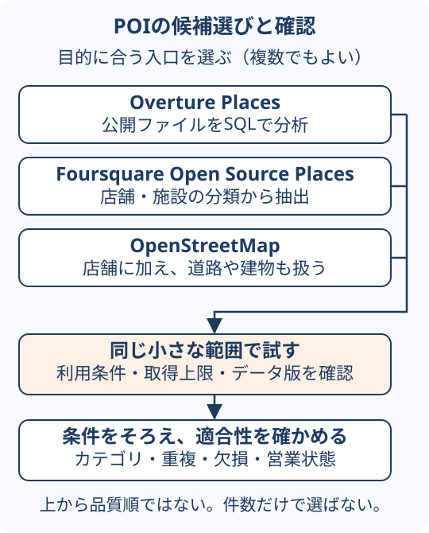

# POIデータを選び、分析する

POIは店舗・施設などの場所の情報である。この案内は、「駅周辺のカフェを調べる」を例に、データ選びから集計結果の確認までをつなぐ。SQLやPythonによる取得例へ進む前に、選び方と比較条件だけ読むこともできる。

## 1. 何を比べるか決める

範囲、対象日、必要な属性を先に決める。例えば「駅周辺のカフェの分布」なら位置とカテゴリ、「店舗へ連絡する」なら連絡先と営業状態も必要になる。データ全体の収録件数だけでは目的への適合性を判断できない。

## 2. 最初に試す候補を選ぶ

以下は入口の選び方であり、品質の順位ではない。複数の条件に当てはまるなら、同じ小さな範囲で試して比較する。

| 最初に試したいこと | 候補 | 試す際の確認点 |
| --- | --- | --- |
| 公開ファイルをSQLで読み、地域を切り出す | Overture Places | データ版、カテゴリ、提供元、必要な属性の欠損 |
| 店舗・施設の分類を使って抽出する | Foursquare Open Source Places | オープン版の仕様、取得上限、カテゴリ階層 |
| 店舗に加え、道路や建物なども扱う | OpenStreetMap | タグ条件、点と面の扱い、地域ごとの整備状況 |

詳しい違いは[3種類の比較](../data/poi-open-data-comparison.md)にまとめている。利用・加工・公開の条件は、採用するデータ版のライセンスで確認する。

<figure markdown="span" id="poi-choice">
  
  <figcaption>候補は用途から選び、共通の確認手順へ進む。並び順は品質の順位を示さず、複数を試してよい。本文の選択基準を基にGeoAIアトラス作成。</figcaption>
</figure>

## 3. 小さな範囲で取得する

bboxは緯度・経度で囲む矩形の範囲である。最初は小さなbboxを使い、取得処理と保存を確認する。件数上限がある検索結果は、その地域の全件とは限らない。

- [FoursquareをDuckDBから取得する](https://blog.masahiko.info/entry/2026/09/25/145139)：トークンを発行し、Icebergカタログを読む。
- [OvertureをDuckDBから取得する](https://blog.masahiko.info/entry/2026/09/26/124845)：公開GeoParquetを読み、範囲とカテゴリで絞る。
- [OpenStreetMapをOSMnxから取得する](https://blog.masahiko.info/entry/2026/09/27/193301)：タグ条件を指定して取得する。

これらは2026年9月の実践記事である。現在のAPI・スキーマでそのまま動くことを本案内で再検証したものではない。取得数、保存数、一意ID数と、LIMIT・ページングの有無を記録する。

## 4. 同じ条件にそろえる

| そろえるもの | 間違えやすい点 |
| --- | --- |
| 範囲 | bboxに交差する形状と、代表点が範囲内にある地物は一致しない場合がある |
| カテゴリ | café、coffee shop、Internet cafeを含める範囲はデータごとに異なる |
| 単位 | 地物の数と実店舗の数は同じとは限らない。点・建物・重複を確認する |
| 時点 | 取得日とデータの更新日は別であり、営業状態が不明なレコードもある |
| 出所 | 複数データに一致していても、元の提供元が同じ場合がある |

例えばFoursquareの「上限500件中のカフェ37件」とOvertureの「カフェ相当202件」は、取得条件とカテゴリが異なる。[後続の比較結果](../data/poi-open-data-comparison.md)も含めて読み、数字だけで優劣を決めない。

## 5. 集計し、結果を説明する

区域別の件数を作る前に、[4店舗の空間結合演習](spatial-join-exercise.md)で境界上の点と未所属の扱いを確かめられる。計算の前提は[座標と測定](../concepts/coordinate-reference-systems.md#measurement)、結果の点検は[検証と適用範囲](../methods/spatial-analysis-validation.md)へ進む。

範囲とカテゴリをそろえて、件数・密度・構成比を作る。その際は「データに収録された施設の分布」を表していることを明記する。POIの多さは、売上や来訪者の多さを直接表さない。

成果物には、取得条件、データ版、カテゴリ対応、欠損と重複の扱いを添える。小さなサンプルを原典と照合してから、別の地域へ広げる。[来歴の残し方](../data/geospatial-record-provenance.md)と[検索の網羅性](../methods/poi-retrieval-coverage.md)も参照するとよい。

## 参照した解説

保存形式や公開方法を選ぶ段階では、[CNGの形式比較](../concepts/cloud-native-geospatial.md#choose-format) → [全国メッシュの配信例](../methods/national-grid-web-delivery.md)の順に読む。分析用のGeoParquetと表示用のPMTilesの役割を分けて検討できる。

- [POI比較と地域特徴量](../data/poi-open-data-comparison.md)：上記実践記事の条件と出典を整理したAtlasページ（2026-10-05確認）。
- [POIオープンデータ入門](https://qiita.com/isshiki/items/4a50f54cc8e5cd649f03)：用途別の選び方（Atlasの2026-09-29確認記録に基づく）。
