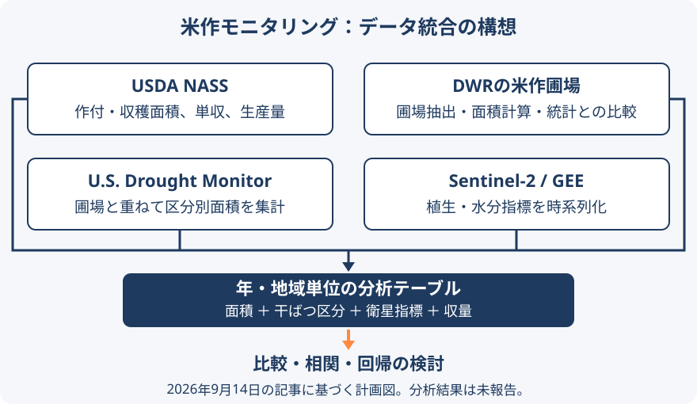

# 農業統計・圃場・衛星データを統合する米作モニタリング

カリフォルニア州サクラメント・バレーの米作を対象に、農業統計、圃場ポリゴン、干ばつ区分、衛星の植生指標を統合する分析構想である。takeofutureが2026年9月14日に公開した記事は全体計画であり、収量推定の精度や分析結果を報告するものではない。

<figure markdown="span">
  
  <figcaption>記事の構想をデータの役割で整理した図。実行済みのパイプラインや検証済みの予測モデルを表すものではない。</figcaption>
</figure>

## データの役割

| データ | 処理と用途 |
| --- | --- |
| USDA NASS | 作付・収穫面積、単収、生産量を比較基準にする |
| California DWR Crop Mapping | 米作圃場を抽出し、面積を計算して統計値と比較する |
| U.S. Drought Monitor | 圃場と重ね、区分別の作付面積を集計する |
| Sentinel-2 / Google Earth Engine | 雲を除外し、NDVI・EVI・NDMIなどを時系列で取得する |

年・地域単位のテーブルにまとめ、相関や回帰を調べる計画である。圃場面積と公式統計の差は、定義・調査時期・作物分類なども分析対象とする。機械学習は十分なデータが得られた場合の検討事項である。

## 出典

- [takeofuture / Zenn：GISで農産物生育状況を確認する:米国編（その0）:全体像](https://zenn.dev/takeofuture/articles/3eeab9552bfa57)（公開日：2026-09-14、2026-09-15確認）
