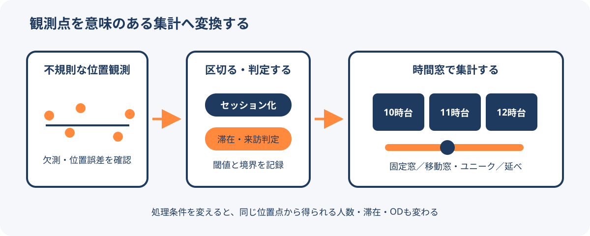

# 人流データの時間処理と集計定義

人流データの位置点は、多くの場合、等間隔には観測されない。位置点を滞在、来訪、通過人数、ODなどへ変換するときは、観測されなかった時間をどう扱うか、どこで行動を区切るか、どの時間窓で集計するかを明示する必要がある。

<figure markdown="span">
  
  <figcaption>観測点をそのまま人数と見なさず、欠測、行動区切り、判定条件、集計窓を順に定義する。</figcaption>
</figure>

## 不規則な観測間隔

端末やアプリの状態、通信環境、測位条件により、位置点の間隔は一定にならない。2点の間に観測がないことは、その間を同じ速度で直線移動したことを意味しない。

- **リサンプリング**は、一定間隔の時間軸へデータを並べ直す処理である。
- **補間**は、観測されていない時刻の位置や値を仮定して埋める処理である。

両者は別の処理である。補間した点を実測点と同じ確度で扱うと、移動距離、経路、滞在時間を過度に精密に見せてしまう。

## セッション化

長い観測空白をまたいで位置点を一続きにすると、別の外出や別の日の移動まで同じ行動として結び付ける可能性がある。一定時間以上の空白、日付の境界、識別子の有効期間などを使ってセッションを分割する。

万能な閾値はない。観測頻度と分析目的に合わせ、何分の空白で分けたかを結果と一緒に残す。

## 滞在・来訪の判定

滞在や施設来訪は、位置点だけに備わった事実ではなく、条件を適用して作るイベントである。主な条件には次がある。

- 一定範囲内にいた時間
- 位置点間の距離と移動速度
- 施設ポリゴンやバッファーへの包含
- 測位精度と観測間隔
- 最短滞在時間と再来訪を分ける時間

同じデータでも、最短滞在時間を変えれば来訪数は変わる。店舗の近くを通っただけの点と、実際の入店を完全に区別できない場合もある。

## 時間窓と集計方法

5分、1時間、日単位などの粒度により、見える変化とノイズが変わる。固定窓は「10時台」のように境界を共有するため比較しやすい。移動窓は任意時点の直近60分などを連続的に評価できるが、隣り合う値が同じ観測を重複して含む。

集計値では、次の違いを区別する。

| 指標 | 数え方 | 注意点 |
| --- | --- | --- |
| ユニーク人数 | 期間内の識別子を重複除去する | 複数期間の値を単純加算できない |
| 延べ来訪回数 | 同じ人の複数回来訪も数える | 人数とは呼ばない |
| 通過カウント | 境界や区間を通った回数を数える | 往復すると複数回になる |
| 滞在人口 | 時間・空間ごとの滞在を集計する | 推計値か観測値かを確認する |

平均値だけでは、イベント、休日、天候によるピークを隠す場合がある。中央値、最大値、曜日別、時間帯別も目的に応じて併記する。

## 空間単位も結果を変える

時間だけでなく、メッシュ、行政区域、施設境界の大きさも集計結果を変える。細かいメッシュは局所差を見せやすい一方、観測数が少なくなり、秘匿処理や推計誤差の影響が大きくなる。細かいほど正確とは限らない。

## 定義を確認するチェックリスト

1. 元の観測間隔と位置精度はどの程度か。
2. 欠測を補間したか。補間方法は何か。
3. セッション、滞在、来訪、トリップをどう定義したか。
4. ユニーク人数、延べ回数、拡大推計値のどれか。
5. 時間窓、曜日、日付変更、時間帯をどう区切ったか。
6. メッシュや施設境界をどう設定したか。

## 関連項目

- [人流データの種類](../data/human-flow-data-types.md)
- [人流データの計測誤差と推計誤差](../data/human-flow-data-quality.md)
- [日本で使える人流データ](../data/human-flow-data-sources-japan.md)

## 出典

- [【人の動きを測る】第11回: 点を意味に変える ── 人流データの解析方法](https://note.com/pacificspatial/n/n03ef6902a12c)（2026-09-07確認）
- [人流データは時間をどう扱う？　観測間隔・滞在判定・時間集計を整理する](https://blog.masahiko.info/entry/2026/09/07/200718)（2026-09-07確認）
