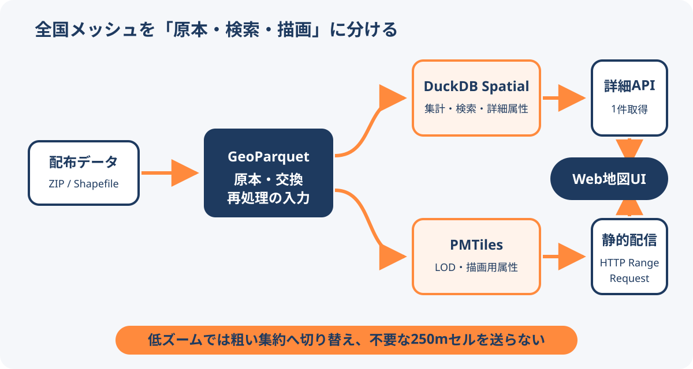

# 全国メッシュデータのWeb配信

全国規模の細密な地域メッシュをWeb地図で扱うときは、保存、検索、描画、詳細取得を1つの形式やサーバーへ集約せず、用途別に分ける。低ズームでは集約済みの粗いメッシュへ切り替え、画面に見えない細粒度ポリゴンを送らない設計が重要である。

<figure markdown="span">
  
  <figcaption>全国メッシュを、原本・検索・描画・詳細取得へ役割分担する構成。</figcaption>
</figure>

## 形式とコンポーネントの役割

| 要素 | 主な役割 |
| --- | --- |
| GeoParquet | 原本、交換、再処理の入力 |
| DuckDB Spatial | ETL、集計、コード検索、空間検索 |
| PMTiles | ズーム別に生成したWeb描画用タイル |
| 静的Webサーバー | HTTP Range RequestによるPMTiles配信 |
| FastAPIなど | 選択されたメッシュの詳細属性を返すAPI |
| OpenLayersなど | 地図表示、ズーム別レイヤー切替、選択UI |

描画に必要な短い属性だけをPMTilesへ入れ、長い属性や詳細情報はDuckDB側へ残す。ユーザーがメッシュを選択したときだけ詳細APIから1件を取得すれば、地図移動のたびに全属性を送らずに済む。

## ズーム別のLOD

検証記事では、全国の250mメッシュを常に描画せず、次の4段階へ集約していた。

| ズーム | 表示単位 | 地物数 |
| --- | ---: | ---: |
| z4〜7 | 20km | 1,510 |
| z8〜10 | 5km | 20,064 |
| z11〜13 | 1km | 501,600 |
| z14以上 | 250m | 8,025,600 |

境界値は地図の用途、画面密度、スタイル、端末性能で調整する。重要なのは固定されたズーム番号ではなく、1ピクセルより細かい地物を低ズームで配信しないことである。

## 全国処理の実測例

2026年9月8日の検証記事では、e-Statの250m境界データ176 ZIPから8,025,600ポリゴンを処理した。記事中の条件では、GeoParquet + ZSTDが0.121GB、DuckDB Spatialが1.037GB、4段階のPMTiles合計が1.079GBで、計測ステージの合計時間は783.9秒だった。

DuckDBではメッシュコード完全一致のmedianが1.030ms、0.05度のBBOX検索が1.758msだった。これは当該環境とデータ設計での測定値であり、一般的な性能保証ではない。PMTiles生成は426.383秒で、全処理時間の約54.4%を占めた。

## 設計上の判断

- 250mメッシュ数を国土面積だけから見積もらず、配布データが海域を含む区画全体を持つか確認する。
- PMTiles配信で `206 Partial Content` が返り、必要範囲だけ取得できることを検証する。
- 読み取り中心ならDuckDB Spatialを候補にし、複数ユーザー編集、同時更新、トランザクションが必要ならPostgreSQL + PostGISなどを検討する。
- 任意SQLをそのままWebへ公開せず、許可した検索、ページング、詳細取得にAPIを限定する。
- 容量、検索時間、生成時間は、属性数、圧縮、空間順序、ハードウェアを添えて記録する。

## 関連項目

- [MapLibre GL JS](../tools/maplibre-gl-js.md)
- [geoparquet-io](../tools/geoparquet-io.md)
- [Portolan](../data/portolan.md)

## 出典

- [全国250mメッシュを実際に扱ってみる その5：OpenLayersで表示し、DuckDBの中身もWebで確認して一区切り](https://qiita.com/rino_yume/items/dd7c105cf37198bedc13)（2026-09-09確認）
