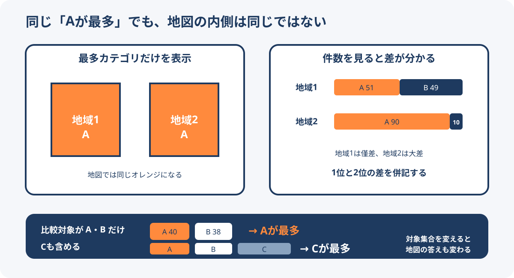

# 地域別最多カテゴリ地図の読み方

地域別最多カテゴリ地図は、地域ごとに件数が最も多いブランド、業態、政党、土地利用などを一つ選び、そのカテゴリーで地域を塗り分ける地図である。分布の大勢を短時間で見せられる一方、対象に含めたカテゴリー、1位と2位の差、地域内の総数を省略するため、地図だけから「市場全体の勢力」を判断することはできない。

<figure markdown="span">
  
  <figcaption>最多カテゴリだけを塗ると、僅差と大差、対象外カテゴリーによる結果の変化が見えなくなる。</figcaption>
</figure>

## 地図が計算しているもの

地域を表す値を `r`、比較対象のカテゴリー集合を `C`、件数を `n(r, c)` とすると、地図に表示するカテゴリーは次の最大値である。

```text
winner(r) = argmax n(r, c)  for c in C
```

結果は集合 `C` の定義に依存する。寿司チェーンを大手3社だけで比較した地図と、地域チェーンを含む全チェーンの地図は、同じ店舗データを使っても異なる問いへ答える。GMSだけを対象とした地図も、食品スーパーやドラッグストアを含む「日常の買い物先」の地図ではない。

## 省略される情報

同じ色で塗られた2地域でも、1位が51店・2位が49店の場合と、1位が90店・2位が10店の場合では優位性が違う。最多カテゴリ地図では、次の情報が見えにくい。

- 1位の件数と構成比
- 1位と2位の差
- 地域内の店舗総数や人口当たり店舗数
- 比較対象に含めなかったブランドや業態
- 同率1位の扱い
- ブランド単位か資本系列単位か
- 都道府県内の市町村差や都市・郊外差
- 集計時点以降の開店、閉店、業態転換

都道府県単位は全国傾向を見せやすいが、生活圏や商圏の実態を表すには粗い場合がある。市区町村、メッシュ、到達時間圏など、問いに合う集計単位を選ぶ必要がある。

## 読み手へ伝える項目

地図のタイトルまたは注記に、少なくとも次を明記する。

1. 対象カテゴリーと除外条件
2. 件数の定義と情報源
3. 集計日または基準日
4. 地域単位
5. 同率の場合の処理
6. ブランドと運営・資本系列の扱い

「スーパー勢力図」のような短い表現を使う場合も、実際の対象がGMSだけなら副題や凡例で明示する。見出しが示す母集団と、集計した母集団を一致させることが重要である。

## 情報を補う表現

- 色で最多カテゴリーを示し、ラベルやツールチップで件数と構成比を出す。
- 色の濃さで1位と2位の差を示す。
- 上位2カテゴリーを表や小さな棒グラフで併記する。
- 全カテゴリー版と特定カテゴリー版を切り替えられるようにする。
- 店舗総数、人口当たり件数、市場全体に占める対象集合の比率を別レイヤーで示す。
- 都道府県地図から市区町村や店舗点へ掘り下げられるようにする。

一枚の静的地図ですべてを表す必要はない。ただし、地図が答える問いと答えない問いを明示し、詳細値へ到達できる表や出典を添える。

## 2026年9月に確認した例

- まちの計量舎による寿司チェーン地図は、スシロー、はま寿司、くら寿司の3社に対象を限定したことをポスト本文で明記し、地域チェーンを含めると結果が変わり得ることも示した。
- 早稲田大学ショッピングモール研究会の地図は、都道府県ごとに店舗数が最も多いGMSを集計し、34道府県でイオンが首位となった。記事ではGMSと食品スーパーの違い、各社サイトから集計した方法、業界再編の経緯を説明している。

## 関連項目

- [日本のロケーションインテリジェンス製品・サービス](../tools/location-intelligence-products-japan.md)
- [小売出店候補地のロケーションインテリジェンス](../cases/retail-site-selection.md)

## 出典

- [まちの計量舎「都道府県ごとに一番店舗数が多い寿司チェーン」](https://x.com/machi_measure/status/2098920593928474930)（2026-09-14確認）
- [日本列島がほぼ「イオン一色」に。早大生の「スーパー勢力図」で見えた、ヨーカドー撤退と34道府県で一強になった背景](https://joshi-spa.jp/1429692)（2026-09-14確認）
