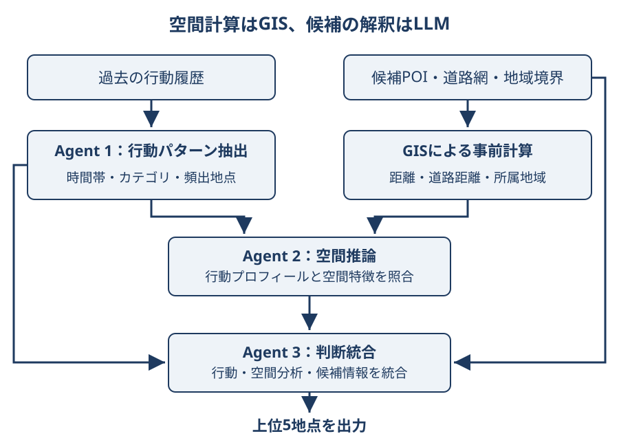

# 空間特徴とLLMエージェントによる次の訪問地点予測

次の訪問地点（next-POI）予測に、事前計算した空間特徴を組み合わせる手法である。Lou・Cuiの論文は、行動履歴の抽出、空間的な候補評価、最終判断を3つのLLMエージェントへ分ける。

<figure markdown="span">
  
  <figcaption>論文の役割分担を要約した模式図。距離計算はLLMの外で行う。GeoAIアトラス作成。</figcaption>
</figure>

## 空間計算と推論の役割

地理的距離、OpenStreetMap道路網の最短経路距離、行政区域との対応を事前計算する。空間推論エージェントは行動プロフィールも参照し、遠いが繰り返し訪れる地点も評価する。最後に候補を統合し、上位5地点を返す。

## 実験の範囲

Massive-STEPS NYCを用い、各設定で100ユーザー、各ユーザー10件の過去軌跡、候補100地点（正解1件を含む）を扱う。以下は3 seedの平均であり、Hit@5は正解が上位5件に入った割合である。

| モデル | 同じ空間特徴を使う単一LLMのHit@5 | 提案手法のHit@5 |
| --- | ---: | ---: |
| Qwen-7B | 0.383 | 0.487 |
| GPT-20B | 0.369 | 0.504 |

一方、Qwen-7BのHit@1は単一LLMが0.213、提案手法が0.209である。著者らは予備的評価と位置付けており、都市をまたぐ一般化や複数回のLLM呼び出しによるコストは別途検討が必要である。

## 出典

- [Enhancing Human Mobility Prediction with Spatially Aware LLM-based Multi-Agent Systems](https://arxiv.org/abs/2609.14227)（2026-09-13（v1、UTC）公開、2026-09-18確認）
- [論文本文 v1](https://arxiv.org/html/2609.14227v1)（2026-09-18確認）
