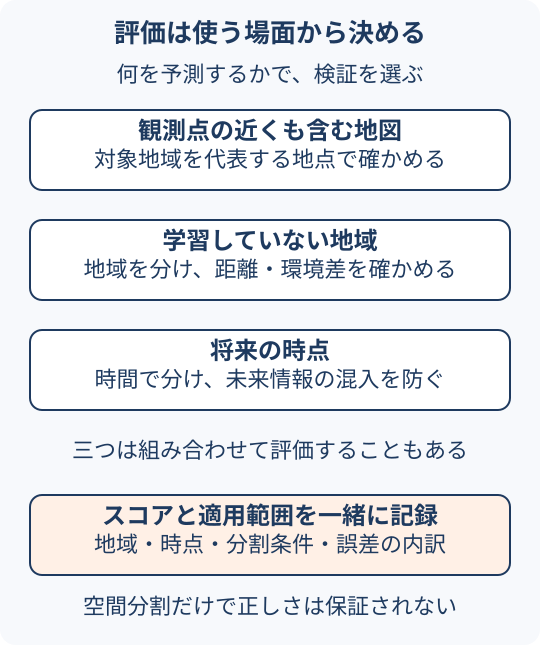

# 分析結果の検証と適用範囲

地図が表示できたこと、処理がエラーなく終わったこと、予測のスコアが高いことは、それぞれ別の確認である。最初に「何を正しいと判断したいか」を決める。このページは、通常のGIS集計から予測モデルまでの検証の入口である。

## まず入力と計算を確かめる

| 確認するもの | 小さく確かめる方法 |
| --- | --- |
| データ | 取得範囲・時点・欠損・重複・取得上限を記録する |
| 位置と単位 | 既知の地点と重ねる。距離・面積の計算方法と単位を確認する |
| 空間結合 | 未所属・複数所属を数え、境界上の例を確認する |
| 集計値 | 少数の対象を手で数える。入力と出力の件数差を説明する |
| AIが生成した処理 | 対象レイヤー・条件・権限を確認し、既知の小例と照合する |

これらは実務上の確認手順である。地図の見た目だけでなく、元データ・件数・単位など別の手掛かりを使う。[空間結合](spatial-join-and-aggregation.md)の模式例も確認用に使える。

## AIの出力ごとに確認を変える { #ai-results }

| 出力 | 確かめること | それだけでは分からないこと |
| --- | --- | --- |
| 画像から抽出した地物 | 正解との対応、誤検出・見逃し、位置・形状 | 他地域・他時期での精度 |
| 埋め込みの類似度・順位 | 何の特徴が似ているか、検索目的に合うか | 売上など別の値の予測精度や因果関係 |
| 予測値 | 未使用データでの誤差、基準モデルとの比較 | 施策を変えたときの因果効果 |
| エージェントの実行結果 | 処理失敗の有無、条件・件数・単位、保存結果 | 集計方法やデータ選択が依頼に適切だったか |

これは[画像解析](imagery-to-gis.md#workflow)、[埋め込み](spatial-embeddings.md#workflow)、[GISエージェント](../concepts/location-ai.md#workflow)の違いを確認するための編集上のチェック表である。

例えば「ツールは成功と返したが0件だった」場合、該当なし、取得範囲の誤り、条件の誤りを切り分ける。「0件は常に失敗」とも判断しない。成果物の値と、そこへ至る条件を併せて確認する。

## 予測モデルは「使う場面」に合わせて評価する

学習に使っていないデータで性能を測るとき、そのデータが実際の利用場面を代表しているかを考える。空間的自己相関は、観測値の関連が位置関係に沿って現れる性質である。近い場所の値が似る場合は正の自己相関に当たる。近隣の観測が学習・評価の両方へ入ると、未知の地域に適用する場合の性能を楽観的に見積もることがある。[1]

<figure markdown="span" id="evaluation-target">
  
  <figcaption>検証方法を選ぶ前に、予測する場所と時点を決める。各方法の優劣や精度を示す図ではない。GeoAIアトラス作成。</figcaption>
</figure>

| 評価したいこと | 設計で考えること |
| --- | --- |
| 観測点の近くを含む、対象地域の地図の精度 | 地域全体を代表する検証地点をどう選ぶか。確率標本を用いた評価が理想となる場合がある |
| 学習していない地域での予測 | 地域を分け、学習地点と検証地点の距離、環境条件の違いを確認する |
| 将来の時点での予測 | 時間順に分け、その時点で入手できなかった情報を特徴量に使わない |

ランダム分割を常に禁止するわけではない。地図全体の精度と新地域への適用では評価する対象が異なる。空間交差検証への批判も含め、予測対象とデータの集め方に合う設計が必要である。[1][2]

空間ブロックに分けても、境界の両側で地点が接近していたり、同じ観測対象が重複していたりすれば、それだけで独立性は保証されない。地域分割だけでは、未来の情報の混入も防げない。

## スコアと一緒に残すもの

- **入力の範囲**：地域、期間、センサーやデータ源、データの版。
- **分割の条件**：地点・施設・地域・時点のどれを単位に分けたか。
- **比較対象**：単純な平均値予測など、目的に合う基準と比べたか。
- **誤差の内訳**：全体の平均だけでなく、地域や対象カテゴリごとの差。
- **適用できる範囲**：学習・検証で扱っていない条件をどこまで含むか。

学習データと性質が違う場所への予測は、得られたスコアだけでは保証できない。適用可能領域（Area of Applicability、AOA）は、学習データとの特徴量上の違いから適用範囲を検討する考え方の一つである。単に地図上で近い範囲を囲むものではない。[3]

## 次に読む

- [地理空間モデルの予測と地理的理解](../concepts/geographic-model-reasoning.md)：説明・予測・因果で評価の目的がどう変わるかを読む。
- [人流データの計測誤差と推計誤差](../data/human-flow-data-quality.md)：観測や推計の偏りを確認する。
- [地理空間データの来歴](../data/geospatial-record-provenance.md)：再現に必要な記録を残す。

## 手を動かして確かめる

[16画素の画像評価演習](../guides/imagery-evaluation-exercise.md)では、正解と予測を図で照合し、誤検出・見逃しと評価指標を手計算・Pythonで確認できる。

## 出典

- [1] [Rolf: Evaluation Challenges for Geospatial ML](https://arxiv.org/abs/2303.18087)（2023、2026-10-05確認。評価目的の整理）
- [2] [Wadoux et al.: Spatial cross-validation is not the right way to evaluate map accuracy](https://alexandrewadoux.github.io/assets/pdf/Wadoux_et_al_2021.pdf)（Ecological Modelling、2021、2026-10-05確認。地図精度評価と標本設計の議論）
- [3] [Meyer & Pebesma: Predicting into unknown space? Estimating the area of applicability of spatial prediction models](https://doi.org/10.1111/2041-210X.13650)（Methods in Ecology and Evolution、2021、2026-10-05確認）
