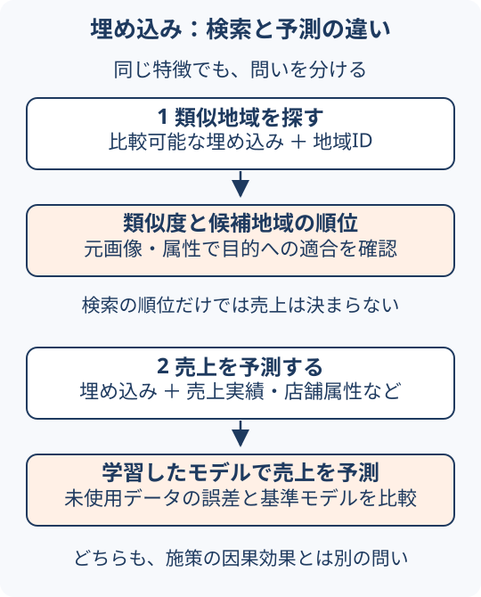

# 空間分析への埋め込みの組み込み

埋め込みは、画像や文章などの複雑な情報を数値ベクトルで表す方法である。空間分析へ結び付ける際は、生成時の空間単位と用途を確認する。

## 入力から検証まで { #workflow }

埋め込みは特徴を表す数値の並びであり、売上や人口などの予測値そのものではない。例えばGoogleのSatellite Embedding V1は、地表の年間の観測を64次元で表すデータである。数値の各軸を、そのまま特定の土地被覆クラス名と読むものではない。

| 段階 | 確認すること |
| --- | --- |
| 入力 | 生成モデル・版、観測期間、空間単位、欠損、利用条件 |
| 処理 | 類似度検索、グループ分け、予測モデルへの入力のどれに使うか |
| 出力 | 類似度や順位、グループID、別途学習したモデルの予測値 |
| 検証 | 検索目的に合うか、グループが安定しているか、予測誤差が改善するかを用途別に調べる |

ベクトルが近いことは、その表現と距離尺度において似ていることを意味する。地図上で近いこと、用途が同じこと、売上が同じことを自動的には意味しない。比較する埋め込みはモデル・版・前処理の互換性を確認し、次元数が同じという理由だけで混ぜない。

予測に使うなら、従来の説明変数だけの場合と、埋め込みを加えた場合を同じ評価条件で比べる。類似地域を探すなら、上位結果を元画像・地域属性と照合し、業務上の「似ている」に合うかを確認する。この比較手順はAtlasの実務上の案内であり、特定データでの精度向上を実証したものではない。

## 類似地域を探すことと売上を予測すること { #search-vs-prediction }

出店候補地Qを調べる場面を考える。画像の埋め込みが近い地域Aを見つけても、それだけでQの売上がAと同じになるとはいえない。店舗規模、業種、競合、営業条件など、画像だけでは十分に表せない違いがある。以下はAtlasの設計例であり、実店舗の分析結果ではない。

<figure markdown="1">

<figcaption>同じ埋め込みでも、目的によって追加するデータ・出力・検証が異なる。GeoAIアトラス作成。二つの用途の模式図であり、精度を示す図ではない。</figcaption>
</figure>

| | 類似地域を探す | 売上を予測する |
| --- | --- | --- |
| 問い | Qと選んだ特徴が似る地域は？ | Qに出店した場合の売上はいくらか？ |
| 用意するもの | 比較可能な埋め込み、地域ID、検索範囲 | 埋め込み、売上実績、必要な店舗・地域属性、対象時点 |
| 出力 | 類似度と候補地域の順位 | 売上の予測値 |
| 確認 | 上位地域を元画像・属性と照合し、用途に合うか | 未使用データで予測誤差を測り、埋め込みなしの基準モデルと比べる |

類似地域の売上をそのまま転用・平均する場合も、一つの予測方法として誤差を検証する。「検索だから検証不要」にはならない。また、出店や施策によって売上がどれだけ増えるかは[因果効果の問い](../concepts/geographic-model-reasoning.md#prediction-explanation-causality)であり、売上予測の精度だけでは答えられない。

## 「近い」は何で決まるか { #similarity-example }

### 数値を変えなくても、尺度で順位が変わる例

説明用の2次元ベクトルを、Q = (1, 0)、A = (2, 0)、B = (1, 0.2)とする。**実モデルの埋め込みではなく、長さをそろえていない架空の数値**である。軸は経緯度や「人口」「売上」を表さない。

| Qとの比較 | A | B | この条件での1位 |
| --- | ---: | ---: | --- |
| ユークリッド距離（小さいほど近い） | 1.000 | 0.200 | B |
| コサイン類似度（大きいほど同じ向き） | 1.000 | 約0.981 | A |

ユークリッド距離は各成分の差を二乗して足した平方根で、この例のBなら `√(0² + 0.2²) = 0.2`。コサイン類似度はベクトルの内積を両者の長さの積で割り、Bなら `1 / √1.04 ≈ 0.981` となる。AはQと長さが違うが同じ向きなので、コサイン類似度は1である。[3][4]

ただし、**すべてを長さ1にそろえた場合**は、ユークリッド距離の二乗が `2 − 2 × コサイン類似度` となり、両尺度の順位は一致する。この反例を「尺度を替えると必ず順位が変わる」と読まない。Google Satellite Embedding V1は元の画素ベクトルが長さ1と説明されているため、上表の未正規化の例をそのまま適用しない。区域内の平均などで加工した後の長さや扱いは、改めて確認する。[2]

### 特徴と空間単位も確認する

| 変えるもの | 「似ている」の意味への影響 | 確認すること |
| --- | --- | --- |
| 表現の元になる情報 | 地表の画像が似ることと、POIの業種構成が似ることは違う | 業務で比べたい特徴が含まれるか |
| 各成分の尺度・重み | 追加した売上や人口などの大きな数値が距離を支配することがある | 元モデルの推奨方法と、追加変数の単位・前処理 |
| 対象範囲・集約方法 | 店舗周辺と自治体全体の平均では、表す場所が違う | 空間単位、集約方法、欠損の扱いを比較対象でそろえる |

学習済み埋め込みの軸を、人が意味を付けた通常の属性のように選別しない。Googleの当該データでは64バンド全体を使い、各軸を独立に解釈しないよう説明されている。[2] 標準化や次元削減を一律に追加するのではなく、仕様と検索結果を確認する。

## 結果を読む前の確認 { #check-results }

1. **検索**：何を似ているとみなすかを決め、上位結果と合わない例を元画像・属性で点検する。類似度0.98を「98%の確率で同じ地域」と解釈しない。
2. **予測**：使う地域・時点に合わせて学習と評価を分ける。前処理やモデル選択に評価用の売上を混ぜず、予測時点より後の情報を入力しない。
3. **比較**：埋め込みなし／ありを同じ分割・指標で比べ、どの地域・店舗で誤差が残るか記録する。
4. **因果**：似ている地域や当たる予測が得られても、施策の効果を示したことにはならない。介入の問いは別に設計する。

このリストはAtlasの実務上の案内である。具体的な分割は[検証と適用範囲](spatial-analysis-validation.md)で確認する。本ページでは架空ベクトルの計算のみを確認し、実データ検索・売上モデルの学習・性能比較は行っていない。

## 空間スケールを合わせる

| 分析単位との関係 | Esriの記事が示す考え方 |
| --- | --- |
| 同じスケール | 共通IDや1対1の空間結合で対応付ける |
| 埋め込みのほうが細かい | ポリゴン内で平均などを計算できるが、情報損失と集約の妥当性を検証する |
| 埋め込みのほうが粗い | 複数の点に同じ値が割り当たり、個々の違いを表せない場合がある |

## 用途ごとの扱い

予測では従来変数との併用が有効な場合があるが、変数選択に依存し、精度向上を保証しない。係数の解釈も変わり得る。

類似度検索・クラスタリングでは、記事は標準化や従来変数の混在が埋め込みの意味を変える点に注意を促している。この助言を全モデル共通の禁止則とせず、利用する埋め込みと距離尺度に応じて検証する。

## 人の活動を表す地域埋め込み：PDI

GoogleのPopulation Dynamics Insights（PDI）は、地域の特徴を機械学習へ入力するためのデータセットである。2026年4月22日のプレビュー発表では、検索傾向、Mapsの混雑・POI、天候・大気質などの集約情報を330次元のベクトルにし、月次更新でBigQueryへ提供すると説明している。発表時点の対象は17か国、単位はS2レベル12（およそ3〜6km²）である。

成功店舗に似た地域の探索や、既存の需要予測モデルへ特徴を追加する用途を想定する。衛星画像由来の埋め込みとは入力情報が異なり、個人の移動履歴そのものを受け取るデータではない。自社の店舗・商圏とセルの大きさ、予測時点と月次更新の対応を確認する。

Googleは米国の29予測対象などで性能向上を報告しているが、任意の地域や自社売上での改善を保証するものではない。今回確認したのは発表記事であり、提供地域・契約条件の個別確認、データ取得、性能比較は未実施。10月の新規発表とは区別する。

## 次に読む

- [GeoAIの手法選択](../concepts/geoai-overview.md#choose-method)：画像抽出や操作支援との役割の違いを読む。
- [予測・説明・因果](../concepts/geographic-model-reasoning.md)：予測に役立つ特徴と原因の説明を区別する。
- [検証と適用範囲](spatial-analysis-validation.md#ai-results)：類似度と予測精度を分けて評価する。

## 出典

- [Including Embeddings in Your Spatial Analysis Workflows](https://www.esri.com/arcgis-blog/products/arcgis-pro/geoai/including-embeddings-in-your-spatial-analysis-workflows)（[1]。2026-10-06再確認）
- [Google: Satellite Embedding V1](https://developers.google.com/earth-engine/datasets/catalog/GOOGLE_SATELLITE_EMBEDDING_V1_ANNUAL)（[2]。2026-10-06確認。データ取得・モデル実行は未実施）
- [scikit-learn: cosine_similarity](https://scikit-learn.org/stable/modules/generated/sklearn.metrics.pairwise.cosine_similarity.html)（[3]。定義を2026-10-06確認）
- [scikit-learn: euclidean_distances](https://scikit-learn.org/stable/modules/generated/sklearn.metrics.pairwise.euclidean_distances.html)（[4]。定義を2026-10-06確認）

- [Google：Population Dynamics Insightsのプレビュー発表](https://mapsplatform.google.com/resources/blog/from-static-maps-to-geospatial-ai-announcing-population-dynamics-insights/)（2026-04-22公開、2026-10-06確認）
