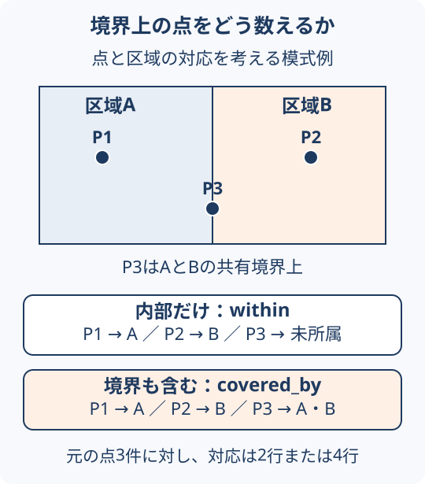

# 空間結合と集計の基本

空間結合は、「区域の内側にある」「境界に触れる」などの位置関係で、別々のデータを結び付ける処理である。例えば店舗の点に町丁目名を付け、その後で町丁目ごとの店舗数を集計する。名前やIDの一致で結ぶ通常の表結合とは、対応を決める条件が異なる。[1]

前提は[座標参照系](../concepts/coordinate-reference-systems.md)である。ベクターデータは点・線・面と属性で対象を表す。ラスターデータは格子の画素に値を持つ。本ページでは、点と面のベクターデータを扱う。

## 境界上の点はどこに入るか

隣り合う区域A・Bと、境界上を含む3点を考える。以下は実在の地域を示さない説明用の例である。

<figure markdown="span" id="boundary-example">
  
  <figcaption>点を左、区域を右にして判定する例。境界を含めると、同じ点に複数の対応行ができる。GeoAIアトラス作成の模式図。</figcaption>
</figure>

| 点と区域の判定 | この例の結果 | 注意点 |
| --- | --- | --- |
| 点が区域の内部にある（within） | P1→A、P2→B。P3はどちらにも対応しない | 境界上の点を別に確認する |
| 点が区域の内部または境界にある（covered_by） | P1→A、P2→B、P3→AとB | 対応は4行になるが、元の点は3件である |
| 点と区域が共通の位置を持つ（intersects） | この点・面の例ではcovered_byと同じ | 線や面同士の判定に一般化しない |

Shapelyの`within`と`covered_by`には上記の境界の違いがある。[2][3] 一つの所属が必要なら、公式の区域ID、住所、業務上の優先順位など、採用する規則を先に決める。境界から点を無条件にずらして解決しない。

## 集計前後で確認する

1. **入力をそろえる**：座標系、対象時点、店舗カテゴリ、点のIDを確認する。
2. **対応を作る**：内部・境界・近接のどれを判定するか決める。区域外の点も点検できるよう残す。
3. **対応数を調べる**：各点が0区域・1区域・複数区域のどれに対応したか数える。
4. **集計する**：対応行数と一意な店舗ID数を区別する。元データ自体の重複も別に処理する。
5. **結果を照合する**：元の点・区域を重ね、未所属や複数所属の例を確認する。店舗が0件の区域とデータ未取得の区域も区別する。

一意な店舗数を区域ごとに数えても、区域をまたいで重複する店舗があれば、区域別件数の合計は全体の一意件数と一致しない。

## 区切り方を変えると見え方も変わる

同じ店舗でも、町丁目別・市区町村別・メッシュ別では集計結果が異なる。集計範囲の大きさや区割りによって統計的な関係が変わる問題を、MAUP（可変単位地区問題）という。[4] 比較には同じ時点・定義の区域を使い、必要なら別の粒度でも結論が変わらないか調べる。細かくすれば常に正しいわけではない。

また「件数」「面積当たりの密度」「人口当たりの件数」は異なる指標である。人口当たりの指標では、分母となる人口の時点と区域もそろえる。

## 紙の上で確かめる

図の3点について、境界を含める場合と含めない場合の対応表を作る。元の点の数、対応行の数、区域別件数をそれぞれ数え、なぜ違うかを説明する。この模式例は関係を理解する課題であり、実データやGISソフトの実行結果ではない。

## 次に読む

- [4店舗で試す空間結合と件数の検証](../guides/spatial-join-exercise.md)：区域外の点を追加し、手計算とShapelyで件数の落とし穴を確かめる。

- [ポリゴンのメッシュ集計と被覆率](polygon-mesh-aggregation.md)：面同士の重なりと二重計上を扱う。
- [POIデータを選び、分析する](../guides/poi-workflow.md)：入力データの取得・比較へ進む。
- [分析結果の検証と適用範囲](spatial-analysis-validation.md)：件数の照合からモデル評価までを整理する。

## 出典

- [1] [GeoPandas: Merging data](https://geopandas.org/en/stable/docs/user_guide/mergingdata.html)（2026-10-05確認）
- [2] [Shapely: within](https://shapely.readthedocs.io/en/stable/reference/shapely.within.html)（2026-10-05確認）
- [3] [Shapely: covered_by](https://shapely.readthedocs.io/en/stable/reference/shapely.covered_by.html)（2026-10-05確認）
- [4] [Esri GIS Dictionary: Modifiable Areal Unit Problem](https://support.esri.com/en-us/gis-dictionary/modifiable-areal-unit-problem)（2026-10-05確認）
