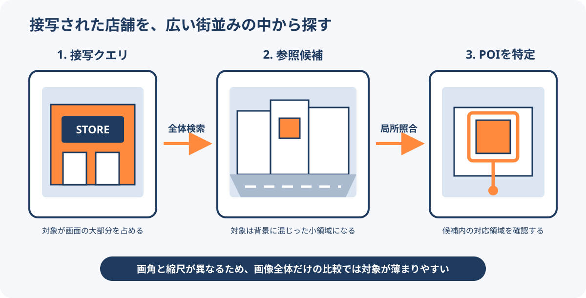

# 店舗画像によるPOIローカライゼーション

店舗画像によるPOIローカライゼーションは、利用者が撮影した看板や店舗入口の接写画像を、位置情報付きの車載ストリートビュー画像群と照合し、同じPOIを探す手法である。地図の作成・更新、POIの確認、店舗位置の付与などに使える。

<figure markdown="span">
  
  <figcaption>接写側は対象が大きく、参照側は街並みの一部に小さく写る。全体検索の後に局所領域を照合する流れ。</figcaption>
</figure>

## Visual Place Recognitionとの違い

一般的なVisual Place Recognition（VPR）は、同じ場所を似た画角と縮尺で撮った画像同士を照合することが多い。店舗POIでは、クエリ画像の大部分を占める看板や入口が、参照画像では複数店舗や道路、車両に囲まれた小さな領域になる。天候、昼夜、反射、遮蔽、撮影機器の違いも重なる。

画像全体を1つの特徴ベクトルへまとめるだけでは、小さな対象の情報が背景に薄められる。このため、街並み全体から候補を絞る処理と、候補画像内の局所領域を照合する処理を分けて考える必要がある。

## GeoStoreベンチマーク

GeoStoreは、この非対称な照合を評価するために提案されたベンチマークである。

- 1,215地点と11,133枚の参照画像を収録する。
- 972地点を学習、243地点をテストに分け、地点と画像の双方を重複させないopen-set設定を採る。
- 学習には正例が付いた676地点、評価には170件の有効なクエリを使う。
- 参照画像には晴天、雨、霧、昼夜、モーションブラー、フロントガラスの反射、遮蔽などが含まれる。

評価件数は限定的であり、特定地域で得た結果をそのまま別地域、別言語、別の店舗景観へ一般化できるとは限らない。論文は2026年9月時点でプレプリントであり、ベンチマークとコードは今後公開すると記載されている。

## GLAMの構成

GLAM（Global-to-Local Asymmetric Matching）は、DINOv2を共有エンコーダーとし、次の2経路を組み合わせる。

1. グローバル経路で画像全体の特徴を比較し、検索候補を安定して絞る。
2. ローカル経路で参照画像を361個の領域トークンとして保持し、接写クエリを1つのprobeとして照合する。
3. 類似度の高い8領域をsoft top-k MaxSimで集約し、全体スコアと融合する。
4. 上位候補では同じ領域トークンを使って再ランキングする。

クエリ側を探す必要はなく、広い参照画像側だけを領域に分ける点が非対称である。実験では、GLAMの再ランキング前がR@5 37.1、R@10 45.3、mAP 22.5、再ランキング後がR@1 25.3だった。比較対象FoLの再ランキング後R@1は20.0である。

再ランキング用の局所特徴は参照画像1枚あたり0.18MBで、FoLの0.92MBの5分の1だった。1画像ペアの照合量は約5.9 M-MACsで、FoLの約1.66 G-MACsに対して約280分の1と報告されている。これらはGeoStore上で同論文が測定した値であり、実システムの精度や処理時間を直接保証するものではない。

## 実務で確認する点

- 検索対象地域、店舗カテゴリー、撮影時期をまたいだ再現性
- 閉店、移転、改装、看板変更を含むPOIの時間変化
- 位置情報や画像の誤登録を正例として学習するリスク
- 類似するチェーン店舗や隣接店舗の取り違え
- 顔、車両番号、私有地など撮影画像に含まれる情報の扱い
- 自動照合の信頼度と、人が確認する境界の設計

## 関連項目

- [Foursquare Placesへのパートナーデータ取り込み](../data/foursquare-partner-places.md)
- [Location AI](../concepts/location-ai.md)

## 出典

- [GeoStore: Finding Small Storefronts in Large Scenes](https://arxiv.org/abs/2609.02012)（2026-09-11確認）
- [GeoStore HTML版](https://arxiv.org/html/2609.02012v1)（2026-09-11確認）

