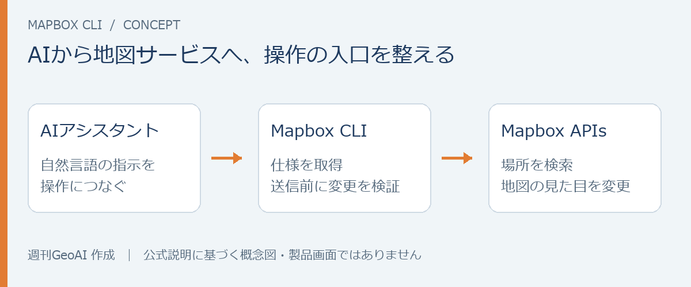
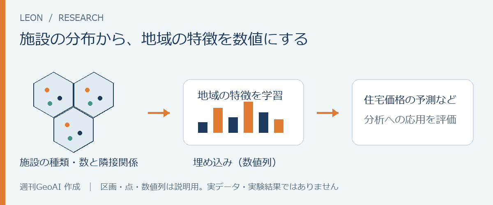

# 週刊GeoAI｜ニュース版サンプル

**MapboxがAI向けCLIを公開、POIから地域を学ぶ研究も**

2026年10月4日〜10日

今週は、AIから地図サービスを操作するためのMapbox CLIが登場しました。OpenStreetMapの店舗・施設データから地域の特徴を学ぶ研究も公開され、地図とAIをつなぐ動きが、開発ツールと分析手法の両面で見られます。

実際の事業への導入では、コメ兵の出店候補地をAIと地理空間データで調べる事例に注目しました。後半には、地図の境界表示の改善や分析コンペの案内、歩いて近い駅を探す地図も紹介します。

## 今週の注目ニュース

### 1. Mapbox、AIコーディングツール向けのCLIを公開

Mapboxは10月8日、AIコーディングツールから場所の検索や地図のスタイル変更などを行うためのCLI（コマンドで操作するツール）を発表しました。MITライセンスで公開されています。

*公式説明をもとに本誌作成。製品画面ではなく、役割を整理した概念図です。*

特徴は、AIが操作の仕様を取得でき、変更内容をAPIへ送る前に検証できること。自然言語の指示から地図を作る際に、AIが参照・確認できる仕組みをツール側が用意しています。なお、CLIの公開ライセンスとMapboxのAPI・データの利用条件は別です。

**ここに注目：** AIによる地図開発を支えるのは、モデルの能力だけでなく、操作対象となるサービスの整備でもあります。

[Mapboxの発表を読む →](https://www.mapbox.com/blog/new-mapbox-cli-for-coding-agents)

### 2. 店や施設の分布から地域を学ぶ「LEON」の論文が公開

OpenStreetMapの施設分布から地域の特徴を学習する研究「LEON」のプレプリントが公開されました。地域を六角形の区画に分け、施設の種類・数と隣接区画の関係から、分析に使える数値列である「埋め込み」を作ります。

*論文をもとに本誌作成。区画・点・数値列は説明用で、実データや実験結果ではありません。*

著者らは、住宅価格の予測などへの応用を評価しています。施設データを「近くの店を探す」用途から「地域の違いを捉える」用途へ広げる研究として興味深いものです。一方、OSMの記録密度や区画の細かさによって結果が変わる点には留意が必要です。

[論文を読む →](https://arxiv.org/abs/2610.05497)

### 3. コメ兵、AIと地理空間データを出店候補地の調査に導入

ナウキャストは10月8日、コメ兵が「DataLens」を導入したと発表しました。月500件以上寄せられる物件情報の整理に加え、人流・カード決済・公的統計などを使い、候補地と既存店の地域特性を比較する取り組みです。

メールや添付資料からの情報抽出と、地図上での候補地の確認をつなぐ点が特徴です。AIと地理空間分析が日々の業務にどう組み込まれるかを知る事例で、今回の発表では導入による定量的な効果までは示されていません。

[導入発表を読む →](https://prtimes.jp/main/html/rd/p/000000652.000012138.html)

## 短報

### 4. ThinkGeo、地図開発の知識をAIに渡す「Agent Skills」を公開

10月7日、.NET向け地図開発で使う手順や注意点をAIコーディングツールに渡す仕組みを公開。地図ライブラリの提供側が、AIの開発支援に必要な知識も配布する動きです。

[ThinkGeoの発表 →](https://thinkgeo.com/blog/thinkgeo-agent-skills)

### 5. Stadia Maps、拡大・縮小で変わっていた境界表示を改善

10月5日、ズーム段階によって境界線が消えたり、係争地域の扱いが変わったりする問題への対応を発表しました。地図の見た目だけでなく、表示の一貫性に関わる更新です。

[Stadia Mapsの発表 →](https://stadiamaps.com/blog/updated-boundary-layers-across-zoom-levels/)

### 6. 国交省、地理空間データで都市のにぎわいを予測するコンペを案内

10月9日、第3回の地理空間データ分析コンペティションを発表。キックオフイベントは10月22日です。地理空間データを使った予測に関心がある人は、課題や参加条件を確認しておきたいところです。

[国土交通省の案内 →](https://www.mlit.go.jp/report/press/tochi_fudousan_kensetsugyo17_hh_000001_00090.html)

## 今週の地図

### 7. 「歩いて一番近い駅」で首都圏を塗り分ける

筆者が10月8日に公開した「駅の縄張りマップ」です。歩ける道路に沿った推計距離で最寄り駅を求めると、直線距離で考えたときとは違う駅が近くなる場所も見えてきます。駅からの徒歩15分圏も表示できます。

普段使う駅の周辺を眺めると、駅の選び方が少し変わるかもしれません。実際の駅出入口や信号待ちは未反映で、公式の駅勢圏を示すものではありません。

[駅の縄張りマップの記事を読む →](https://blog.masahiko.info/entry/2026/10/08/124653)

---

本誌では、地図・位置情報・POIなどの地理空間データを、機械学習やデータサイエンスの手法で分析・活用する領域をGeoAIと呼びます。

*構成・読み心地を比較するための試作です。導入文と「ここに注目」は編集案で、ご本人の所感として確定したものではありません。記事本文を確認して紹介していますが、製品・コード・モデルの動作検証は行っていません。正式な配信号には含めていません。*
